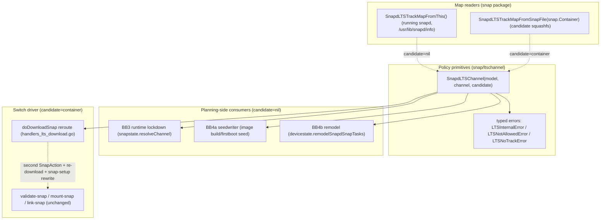

# Design: Force snapd onto ESM track (UC042 spike)

Status: Spike / exploratory design — converged on **download-stage reroute**
mechanism. See [FOCUS.md](FOCUS.md) for the short-form description of the
chosen mechanism and immediate next steps; this document is the long-form
rationale.

Related specs:
- UC042 "Snapd ESM tracks for Ubuntu Core" (the concise mechanism spec)
- UC039 "Ubuntu Core Support Process" (the lifecycle/process context)

**Direction:** the *candidate* snapd squashfs (the blob just downloaded from
the store) is the source of truth for LTS-track policy. The reroute happens
in `doDownloadSnap`, after the blob lands, before `validate-snap` runs. If
the candidate's compiled-in map says the device's UC base must move to an
LTS track that differs from the planned channel, snapd issues a second
`SnapAction` on the LTS channel, re-downloads over the same blob path, and
rewrites the task's `snap-setup` so the existing `validate-snap → mount-snap
→ link-snap` graph completes on the correct track. No task-graph mutation
in a running handler; no two-stage refresh; a single change ends with one
snapd revision linked on the correct track.

This document captures the gap analysis, the snapd-behaviour investigation
that grounds it, the functional decomposition into building blocks, the
decisions that led to the current implementation, and the remaining work.
Earlier exploratory designs (post-link `check-lts-channel` task injection,
planning-time probe, same-change `InjectTasks`) are preserved in the
**Appendix: Rejected approaches** at the end of this file.

---

## 1. Problem statement

Ubuntu Core is moving to per-version snapd tracks. When a UC version reaches
year 6 (ESM-equivalent), snapd must transition from `latest/<risk>` to
`<UC-version>/<risk>` (e.g. `18/stable`, `22/edge`) and follow a frozen
`release/lts/<UC-version>` branch instead of master.

We need a mechanism that:
- Forces existing in-field devices onto the track matching their UC version.
- Switches snapd's track **before any other snap updates are applied**
  (UC039 requirement).
- Locks down which snapd tracks may be used (pre-ESM: only `latest`;
  post-ESM: only that UC version's track).
- Reinterprets old model assertions so they remain valid.

A constraint that drives the entire design: **asymmetric knowledge**. The
running snapd may not know that the device's UC base now has an LTS track;
the new snapd it is about to install does. Therefore the authoritative
decision must use the candidate's data, not the running snapd's data.

---

## 2. What UC042 specifies (summary)

- snapd holds a compiled-in map of ESM UC versions -> snapd tracks, updated
  when a snapd version becomes the ESM version for a UC release.
- On install/refresh, snapd finds the UC release from the model boot base
  (18, 20, ... via the running UC version, not the snapd build base),
  combines it with the current risk, and switches track (snapd uses
  track/risk only).
- When an "unaware" snapd refreshes to an "aware" one (or an aware one is
  started on installation), the aware snapd switches to the ESM track and
  refreshes to the snapd found there, "in the same change by the new snapd
  inserting tasks as it starts to run".
- Unasserted snapd: `--amend` only allowed onto the ESM track; unasserted
  snaps skip the lockdown check.
- Model `default-channel: latest/<track>` is reinterpreted by an ESM (or
  newer) snapd as `<UC_version>/<track>`, at image build and remodel.
- Pre-ESM UC versions cannot use non-`latest` tracks; ESM UC versions cannot
  use tracks other than their own. FIPS will later need new track-name
  behaviour.

**Divergence from UC042 literal mechanism.** UC042 describes the switch as
the new snapd "inserting tasks in the same change" — i.e. two sequential
snapd revisions linked in one change (latest → aware → LTS), driven by
post-link task injection. The spike has rejected that mechanism (see
Appendix) and replaces it with a **planning-time reroute using the
candidate's metadata** inside `doDownloadSnap`. The end-state is the same
(one change lands on the LTS track before other snaps' tasks run, courtesy
of `typeOrder` and `arrangeRebootAndUpdateSeed`); the mechanism is
different.

---

## 3. snapd behaviour investigation (grounding)

All claims below were verified against the codebase.

### 3.1 snapd-first ordering and self-modifying changes
- snapd sorts ahead of everything via `typeOrder` (`TypeSnapd: 0`) in
  [snap/types.go](snap/types.go); `doUpdate` sorts updates by type
  ([overlord/snapstate/snapstate.go](overlord/snapstate/snapstate.go)).
- Cross-snap ordering is wired in `arrangeRebootAndUpdateSeed`
  ([overlord/snapstate/reboot.go](overlord/snapstate/reboot.go)): snapd's
  task set goes first and every other snap's first task waits on the final
  snapd task. Consequence relevant to this spike: as long as the change
  ends with snapd on the correct track, other snaps will refresh against
  that snapd. We do not need to inject a second snapd cycle.
- A running handler **can** append tasks to its own in-flight change via
  `InjectTasks` and the `chg.AddAll(...)` + `st.EnsureBefore(0)` pattern
  (`doCheckReRefresh`, `doConditionalAutoRefresh` in
  [overlord/snapstate/handlers.go](overlord/snapstate/handlers.go)). The
  spike **considered and rejected** this for the snapd track switch (see
  Appendix: state-mutation risk, double-link).
- After a snapd-snap refresh, `link-snap` requests a daemon restart; the
  change is persisted and resumes under the new snapd, guarded by
  `FinishRestart` ([overlord/snapstate/snapstate.go](overlord/snapstate/snapstate.go)).

#### Restart vs reboot when snapd is involved

`arrangeRebootAndUpdateSeed` controls **task ordering** and **system
reboot** boundaries for boot participants (base, gadget, kernel). Snapd
install/refresh uses `finishTaskWithMaybeRestart` in
[overlord/snapstate/handlers.go](overlord/snapstate/handlers.go) for
**daemon restart** at `link-snap`. Do not assume a snapd change always
reboots the machine.

| Scenario | Daemon restart? | System reboot? |
|----------|-----------------|----------------|
| snapd snap install/refresh (normal) | Yes (at `link-snap`) | No (by itself) |
| snapd + gadget/kernel/base in same change | Yes for snapd | Maybe (from essentials / seed-refresh) |
| Preseed | No (deferred to first boot) | N/A |

### 3.2 Model base -> UC version
- `naming.CoreVersion(base)` parses `core`->16, `core18`->18, etc.
  ([snap/naming/core_version.go](snap/naming/core_version.go)).
- `asserts.Model.CoreVersion()` wraps it for callers that hold the model
  ([asserts/model.go](asserts/model.go)).
- The model is reachable at runtime via `DeviceCtx(...).Base()` /
  `DeviceCtx(...).Model()`
  ([overlord/devicestate/devicectx.go](overlord/devicestate/devicectx.go)).
- The snapd tracking channel lives in `SnapState.TrackingChannel`
  ([overlord/snapstate/snapmgr.go](overlord/snapstate/snapmgr.go)); there is
  no code today that derives snapd's refresh channel from the model base.

### 3.3 Channel/track validation and switching
- `channel.Channel` (track/risk/branch) parsing and `Resolve`/`ResolvePinned`
  in [snap/channel/channel.go](snap/channel/channel.go).
- `resolveChannel` ([overlord/snapstate/snapstate.go](overlord/snapstate/snapstate.go))
  is the central model-constraint check, but it only pins **kernel** and
  **gadget** tracks. The snapd snap is unguarded except via this spike's
  BB3 hook.
- Image build channel resolution: `Writer.resolveChannel`
  ([seed/seedwriter/writer.go](seed/seedwriter/writer.go)).
- Remodel channel resolution: `modelSnapChannelFromDefaultOrPinnedTrack` and
  `remodelSnapdSnapTasks`
  ([overlord/devicestate/devicestate.go](overlord/devicestate/devicestate.go)).

### 3.4 Download-time mutation precedent
- The current `doDownloadSnap`
  ([overlord/snapstate/handlers.go](overlord/snapstate/handlers.go)) already
  contains a **COMPAT branch** that re-queries the store via
  `sendOneInstallActionUnlocked` and rewrites `snap-setup` (SideInfo,
  DownloadInfo, Channel) when `DownloadInfo == nil`. This is the precedent
  the spike leans on: doing a second store action and rewriting the task's
  setup inside `doDownloadSnap` is an established pattern, not a novel one.

### 3.5 amend / unasserted snaps
- `Flags.Amend` ([overlord/snapstate/flags.go](overlord/snapstate/flags.go))
  consumed in `installActionsForAmend`
  ([overlord/snapstate/storehelpers.go](overlord/snapstate/storehelpers.go)):
  emits an `install` store action keyed by name+epoch (no snap-id) for
  unasserted snaps, turning them asserted.
- Asserted vs unasserted is determined by empty `SideInfo.SnapID`;
  sideloaded revisions are negative (`Revision.Local()`).
- Normal refresh ignores snaps with empty SnapID, so an unasserted snapd
  can only move to an asserted store revision via `--amend`.

### 3.6 Existing field track-switch mechanisms (verdict)
- Local admin `snap switch/refresh snapd --channel=...`: **works today**;
  BB3 lockdown now rejects channels that the running snapd's view says are
  policy-violating. Real enforcement is at download.
- Remodel to a model with snapd `default-channel`: **works** (signed
  model); BB4b pre-remaps at planning.
- Store `redirect-channel`: honored on install/seed, **ignored on refresh**
  -> cannot move an installed device's track.
- Gadget defaults, validation sets, snap-declaration, cohorts: **cannot**
  change a track.
- Conclusion: no automatic/store-driven path exists; new snapd logic is
  required, and the lockdown is net-new.

### 3.7 Downgrade tolerance
- Hard floor: `patch.Level`. If the target (frozen LTS) snapd was built
  with a lower major `Level` than what wrote `state.json`, it refuses to
  start (`"cannot downgrade: snapd is too old for the current system
  state"`) - [overlord/patch/patch.go](overlord/patch/patch.go). Sublevel
  diffs are tolerated.
- Epoch: snapd declares no epoch today. If ever bumped, `checkEpochs`
  permanently blocks downgrade below the bump - a one-way door.
- No version-string guard blocks downgrade; version comparisons only
  trigger cleanup (namespace/AppArmor discard) in `doLinkSnap`.
- Safety net: `snap-failure` reverts to the prior revision and
  `FinishRestart` reports `"there was a snapd rollback across the restart"`,
  driving undo.

### 3.8 Ensure/StartUp-driven changes, conflicts, pruning
- Template if BB5 is ever needed: `ensureUbuntuCoreTransition`
  ([overlord/snapstate/snapmgr.go](overlord/snapstate/snapmgr.go)) - seeded
  gate, in-flight gate, persisted backoff timestamp + retry counter,
  conflict-tolerant taskset build, `NewChange` + `AddAll`.
- Exclusive changes: `checkChangeConflictExclusiveKinds`
  ([overlord/snapstate/conflict.go](overlord/snapstate/conflict.go)) lets a
  change kind block all other changes until ready.
- Pruning: changes are removed after `pruneWait` (24h ready), stuck
  non-ready changes have unready lanes aborted after `abortWait` (72h),
  and a 500-change cap applies. Implication: any retry state must be
  anchored in a persisted key, not in the change object.

---

## 4. Gap analysis

1. **Map shape and bootstrap.** Is it a set of UC versions or a
   version->track map (matters for FIPS)? The map must be maintained on
   `master`/`latest` (so field devices ever become aware) and on each LTS
   branch. **Resolved:** flat
   `snapdLTSTrackMap[bootBase][inputTrack] = targetTrack`; ships in
   `/usr/lib/snapd/info` under key `SNAPD_LTS_TRACKS`; backported to all
   LTS branches.
2. **UC version determination + special cases.** Feasible via
   `naming.CoreVersion` and `asserts.Model.CoreVersion()`. UC16 /
   `core`-acts-as-snapd is excluded by UC039 and not addressed by UC042
   (hard-blocked here); classic/hybrid must not misfire (scope-flagged
   `false` by default).
3. **Where to act.** No "after snapd refreshed, now running new snapd"
   hook is acceptable (post-link injection rejected, see Appendix).
   **Resolved:** intercept in `doDownloadSnap` after the blob lands; the
   candidate's map is then on disk and readable from the squashfs; precedent
   exists (§3.4 COMPAT branch). Other snapd code paths that ship a snapd
   (BB4a image build, BB4b remodel) pre-remap at planning using the
   *running* snapd's view; the download intercept is the second line of
   defence for the in-field case.
4. **Source-of-truth selection.** Decided: candidate squashfs at download;
   running snapd's compiled-in map for planning consumers (BB3/BB4a/BB4b)
   that have no candidate yet. Mismatches between the two are expected
   (that is the entire point) and are reconciled by the download intercept.
5. **snapd downgrade.** Latest moves ahead of the frozen LTS track, so the
   reroute can be a downgrade. Constrained by `patch.Level` (§3.7).
   **Open:** whether to pre-flight `patch.Level` against the second
   `SnapAction`'s revision before re-download commits.
6. **Risk preservation and target existence.** Snapd channels are
   track/risk only (UC039). Branches are dropped on remap. Target risk may
   not exist on the UC track; need a fallback. **Open** (item 5 above and
   BB7).
7. **Track lockdown.** Net-new; must be enforced consistently in
   snapstate, image build, and remodel; must skip unasserted snapd; must
   be FIPS-extensible. BB3/BB4a/BB4b cover the planning side; the download
   intercept is authoritative.
8. **Model default-channel reinterpretation.** Terminology ambiguity
   (`latest/<track>` likely means `latest/<risk>`); must apply at image
   build, remodel, and firstboot seeding; snapd-only. Covered by BB4a/BB4b
   (planning side).
9. **Failure / undo.** With reroute, there is no injected sub-graph to
   fail independently. Failure modes are local to `doDownloadSnap`:
   - second `SnapAction` fails → fail download task as today;
   - re-download fails / checksum mismatch → fail download task;
   - candidate-map parse fails → policy decision (block vs fall back to
     running snapd's view), **open**;
   - target revision violates `patch.Level` (BB7) → pre-flight refusal or
     `snap-failure` revert at restart.
10. **Scope.** Mechanism is for in-place transition; new ESM images get
    the right snapd directly. Recovery re-seeds and re-switches.

### Cases the mechanism must cover

1. Existing device, auto-refresh pulls an aware snapd + other snaps -
   download intercept reroutes the snapd download before link, other snaps
   wait per `typeOrder`.
2. Existing device already on an aware snapd that never switched - next
   refresh triggers download intercept; "no refresh ever" case is the
   long-tail gap that BB5 would close.
3. First boot from an old-model image on an ESM UC version - first
   store-driven refresh post-firstboot triggers the download intercept.
4. First boot from a correctly-built ESM image - BB4a baked the right
   channel into `seed.yaml`; no reroute needed.
5. Remodel to a different UC version - BB4b pre-remaps; any store-fetched
   snapd in the remodel also goes through the download intercept.
6. Admin sets a non-permitted track - BB3 rejects at planning using the
   running snapd's view; if BB3 passes (running snapd doesn't yet know),
   the download intercept catches it.
7. Unasserted snapd - lockdown skipped (`snapIDForSnapdChannelLockdown`);
   download intercept also skipped (gated on asserted SnapID); `--amend`
   policy not yet implemented.
8. UC16 / `core`-acts-as-snapd - hard error in `systemBootBaseAllowed`;
   seedwriter UC16 skip.
9. Classic / hybrid - scope flags default `false`.
10. Reroute fails - download task fails; auto-refresh retries on the next
    cycle.
11. Target track patch-level-incompatible - BB7 (open).
12. Target risk missing on UC track - fallback undefined (open).

---

## 5. Functional analysis: mechanisms and building blocks

The mechanism is decomposed into one channel-resolution API (taking an
optional candidate container), two map readers (running vs candidate),
three policy consumers (BB3/BB4a/BB4b — planning side), and **one switch
driver** (download-stage reroute).



### 5.1 Policy primitives (`snap/ltschannel`)

| File | Role |
|------|------|
| [`ltschannel.go`](snap/ltschannel/ltschannel.go) | `SnapdLTSChannel(model, channel, candidate)` plus the `systemBootBaseAllowed` scope gate (UC-only by default, UC16 hard-block, classic/hybrid scope-flagged) |
| [`errors.go`](snap/ltschannel/errors.go) | Typed errors: `LTSInternalError`, `LTSNotAllowedError`, `LTSNoTrackError`, with `errors.Is` sentinels |
| [`export.go`](snap/ltschannel/export.go) | `MockSnapdLTSTrackMap` re-export so other packages' tests can mock the running snapd's map |

**Signature.** `SnapdLTSChannel(model *asserts.Model, channel string,
candidate snap.Container) (string, error)`. Returns the remapped channel
with the LTS target track, the original risk, and any branch dropped.

**Source-of-truth selection:**
- `candidate != nil` → read map from the candidate snap via
  `snap.SnapdLTSTrackMapFromSnapFile`. Authoritative for the download
  driver.
- `candidate == nil` → read map from the running snapd via
  `snap.SnapdLTSTrackMapFromThis`. Used by planning-side consumers
  (BB3/BB4a/BB4b) that have no candidate yet; may be stale; mismatches are
  resolved at download.

**Errors.** `LTSNotAllowedError` for scope (classic/hybrid disabled, UC16,
non-core base); `LTSNoTrackError` for managed boot base without a mapping
or unknown input track; `LTSInternalError` for nil model, parse failures,
or map-load failures.

**Behaviour:** parses the input channel, normalises empty track to
`"latest"`, looks up `[bootBase][inputTrack]`, swaps the track, preserves
risk, drops branch, returns cleaned channel.

### 5.2 Map readers (`snap` package, `info.go`)

| Function | Source |
|----------|--------|
| `SnapdLTSTrackMapFromSnapFile(snap.Container)` | Reads `/usr/lib/snapd/info` from the snap container via `SnapdInfoFromSnapFile`; parses `SNAPD_LTS_TRACKS`. Used for candidate snaps. |
| `SnapdLTSTrackMapFromThis()` | Reads the info file of the currently executing snapd via `snapdtool.InternalLibExecDir() + snapdtool.SnapdVersionFromInfoFile`. Used for the running snapd. |
| `parseSnapdLTSTracks(raw)` | Parses the JSON value: `map[string]map[string]string` keyed by stringified boot-base, normalised to `map[int]map[string]string`. Empty / whitespace input returns `(nil, nil)`. |

The on-disk format is the **metadata contract** still to be agreed (see
§7 step 8): a JSON value of the `SNAPD_LTS_TRACKS` key inside
`/usr/lib/snapd/info`, shape:

```
SNAPD_LTS_TRACKS='{"18":{"latest":"18","fips-updates":"18-fips","18":"18","18-fips":"18-fips"}}'
```

Maintenance coupling: updates to the map ship on master and are backported
wholesale to `release/lts/*` so LTS-branch snapd is coherent with master.

### 5.3 Planning-side consumers

All three call `SnapdLTSChannel(model, channel, nil)` — they have no
candidate at their call site.

| BB | Where | What it does |
|----|-------|--------------|
| **BB3** runtime lockdown | `overlord/snapstate/snapstate.go:resolveChannel` | For snapd installs/switches/refreshes with a non-empty SnapID, calls `SnapdLTSChannel(model, effectiveChannel, nil)` and compares input vs output. `ErrLTSNoTrack` → `cannot use snapd channel %q: LTS policy rejects track %q`. Different output → `cannot use snapd channel %q: LTS policy requires %q`. Skipped for unasserted snapd via `snapIDForSnapdChannelLockdown`. |
| **BB4a** image/firstboot seed | `seed/seedwriter/writer.go:resolveChannel` | For snapd in the seed, calls `SnapdLTSChannel(w.model, resChannel, nil)` after standard resolution. Bakes the LTS-remapped channel into `seed.yaml`. Skips: unasserted snapd in model, path-provided snapd, **UC16 models** (base `core` or empty). |
| **BB4b** remodel | `overlord/devicestate/devicestate.go:remodelSnapdSnapTasks` | For the new model's snapd default-channel, calls `SnapdLTSChannel(rm.newModel, newSnapdChannel, nil)` unless snapd is unasserted in the new model. The remapped channel feeds `maybeInstallOrUpdate`. Unknown-track or UC16 errors fail the remodel at task-build time before any state change. |

Note: BB3 cannot be authoritative because the *running* snapd may not know
the candidate's LTS map. BB3's job is admin UX (reject obviously wrong
inputs early) and consistency for planning. The real enforcement is at
download.

### 5.4 The download-stage driver (primary mechanism)

Lives in
[`overlord/snapstate/handlers_lts_download.go`](overlord/snapstate/handlers_lts_download.go);
hooked into
[`overlord/snapstate/handlers.go:doDownloadSnap`](overlord/snapstate/handlers.go)
right after the blob lands and **before** the task persists the updated
`snap-setup`.

**Gates** (`needsSnapdLTSChannelResolve`):
- `snapsup.Type == snap.TypeSnapd`,
- `snapsup.SideInfo.SnapID != ""` (asserted only),
- `model != nil`.

**Inspect** (`inspectSnapdLTSAfterDownload`):
- Open the squashfs at `snapsup.BlobPath()` (`squashfs.New(blobPath)`).
- Call `ltschannel.SnapdLTSChannel(model, snapsup.Channel, container)`.
- Compare the resulting LTS channel against the planned channel
  (`snapChannelsDiffer`).

**Reroute** (target behaviour — not yet implemented; see §7 step 9):
- Issue a second `SnapAction` on the LTS channel via the existing store
  helpers (precedent: COMPAT branch's `sendOneInstallActionUnlocked`).
- Re-download to the same blob path; honour checksum, integrity, and
  `DownloadInfo` from the new action result.
- Rewrite the task's `snap-setup` in place: `SideInfo` (new SnapID/rev),
  `DownloadInfo`, `Channel`, `Revision`, `SnapPath`.
- Persist via `t.Set("snap-setup", snapsup)`. Downstream tasks
  (`validate-snap`, `mount-snap`, `link-snap`) pick up the corrected setup
  through `snap-setup-task` without any graph mutation.

**Failure handling:**
- Second `SnapAction` error → fail the download task.
- Re-download error → fail the download task.
- Candidate-map parse / load error → **open decision** (block vs fall back
  to running snapd's view); current scaffold logs and continues.
- `patch.Level` violation on rerouted target → BB7 (open).

**Current implementation status:** scaffold only. `inspectSnapdLTSAfterDownload`
computes the remap and logs it via `logger.Noticef`; the second action +
re-download + `snap-setup` rewrite is the **next implementation step**
(§7 step 9).

**Forward/backward compatibility:**
- A snapd that does not implement the download intercept simply never
  reroutes; it would also not be LTS-aware on any other code path, so
  there is no regression.
- A candidate snapd without a `SNAPD_LTS_TRACKS` key produces a `nil`
  map, which results in `LTSNoTrackError` for managed boot bases. Behaviour
  on that error is part of the open "missing map" decision.

### 5.5 Considered and rejected drivers (see Appendix)

- **Post-link `check-lts-channel` + `chg.AddAll`** — UC042's literal
  text; rejected on state-mutation grounds; wrong-track snapd is linked
  first and then a second refresh fires.
- **Planning-time probe at `targetFromActionResult`** — blocks API/Ensure
  during a full download; novel pattern.
- **Same-change `InjectTasks` (BB8)** — same rejection rationale as the
  post-link driver.

### 5.6 Still-open building blocks

- **BB5 `ensureSnapdTrackTransition`** — `SnapManager.Ensure`-driven
  safety net for "aware snapd installed on wrong track, no refresh in
  flight". Smaller surface now that the download intercept handles cases
  1/3/5/6/10. Re-evaluate after spread evidence.
- **BB6 exclusive change kind** — only required if BB5 lands.
- **BB7 downgrade safety** — newest-on-track selection, pre-flight
  `patch.Level` guard on the rerouted target, undo restores original
  channel, verify `FinishRestart` rollback. Still relevant for the reroute
  path.

### 5.7 Coverage map

| # | Case | Covered by |
|---|------|------------|
| 1 | Auto-refresh pulls aware snapd + other snaps | Download intercept reroutes snapd before link; other snaps wait per `typeOrder` |
| 2 | Aware snapd already installed, never switched | Next snapd refresh triggers download intercept; long-tail gap = BB5 |
| 3 | First boot from old-model image on ESM UC | Path-install at firstboot bypasses download intercept; first store-driven refresh post-firstboot reroutes |
| 4 | First boot from correctly-built ESM image | BB4a at image build → `seed.yaml` carries LTS channel → firstboot no-op |
| 5 | Remodel to different UC version | BB4b pre-remap + download intercept on any store-fetched snapd |
| 6 | Admin sets non-permitted track | BB3 rejects via running snapd's view; download intercept catches if BB3 passes |
| 7 | Unasserted snapd / `--amend` | BB3 + download intercept skip via SnapID check; `--amend`-onto-ESM not yet implemented |
| 8 | UC16 / `core`-acts-as-snapd | UC16 hard error in `systemBootBaseAllowed`; seedwriter skip |
| 9 | Classic / hybrid | Scope flags default `false` |
| 10 | Reroute fails | Download task fails; auto-refresh retries next cycle |
| 11 | Target track patch-level-incompatible | **Open** — BB7 |
| 12 | Target risk missing on UC track | **Open** — BB7 |

### 5.8 Firstboot trace

`overlord/devicestate/firstboot.go:populateStateFromSeedImpl` reads the
seed and calls `installSeedSnap` per snap, which uses `pathInstallGoal` +
`snapstate.InstallOne`. For snapd this lands in
`target.go:targetForPathSnap` → `resolveChannel` (BB3 fires for asserted
seeded snapd). **`doDownloadSnap` is not invoked** at firstboot (path
install).

| Sub-case | What happens at firstboot | Reconciliation |
|----------|---------------------------|----------------|
| **Case 4** (ESM image) | BB4a already wrote LTS channel into `seed.yaml`; firstboot install is a no-op for LTS | none needed |
| **Case 3** (old image, LTS not yet known at build) | Seeded snapd's LTS map didn't cover the UC version at image build; BB4a passed through; firstboot installs on `latest/<risk>` | First store-driven refresh post-firstboot triggers download intercept → reroute |
| Inconsistent seed (admin/build mistake) | BB4a bypassed or hand-edited; BB3 errors at firstboot: `cannot use snapd channel "X": LTS policy requires "Y"`; firstboot fails loudly | requires image fix |

### 5.9 Remodel trace

`remodelSnapdSnapTasks` (devicestate.go):

1. Compute `newSnapdChannel` (model default or `latest/stable`).
2. **BB4b** remap via `SnapdLTSChannel(rm.newModel, ..., nil)` (skipped if
   snapd unasserted in new model).
3. Dispatch via `maybeInstallOrUpdate`:
   - Not installed → store or path install goal; BB3 fires at
     `resolveChannel`; download intercept fires for store goal.
   - Installed, channel-only change → `snapstate.Switch`; BB3 fires; no
     `doDownloadSnap` (no refresh), so the download intercept does not
     run.
   - Installed, channel+revision change → `UpdateOne` (refresh path); BB3
     + download intercept.
   - No changes → no-op.

Unknown tracks or UC16 in the new model error at step 2, before any state
change. **Offline remodel** uses path-install goals; the download
intercept doesn't fire, and BB4b's planning-time remap (still using the
running snapd's view) is the only line of defence.

---

## 6. Decisions and rationale

### Source of truth

- **Candidate squashfs is authoritative.** The running snapd may pre-date
  the LTS onboarding of the device's UC version; only the candidate is
  guaranteed to carry the right map. Planning consumers consult the
  running snapd as a best-effort hint; the download intercept is the real
  enforcement.

### Switch driver strategy

- **Download-stage reroute is the primary mechanism.** Justified by:
  - Asymmetric knowledge — only the candidate is authoritative.
  - No graph mutation in a running handler; no double-link.
  - Reuses an existing precedent in the same function (§3.4 COMPAT
    branch); not a novel pattern.
  - Keeps the change atomic — one change, one snapd revision linked on
    the correct track.
  - Cross-snap ordering (`typeOrder` + `arrangeRebootAndUpdateSeed`) makes
    other snaps wait for snapd's final task for free; no extra ordering
    machinery required.
- **Refresh-retry self-healing** is acceptable for the "aware snapd
  already installed, never switched" long-tail case (case 2): auto-refresh
  runs ~4×/day and any new snapd revision triggers the download intercept.
  BB5 is belt-and-suspenders.

### Policy primitives

- **`SnapdLTSChannel` takes an optional `candidate snap.Container`.** A
  single API expresses both source-of-truth modes; callers do not have to
  decide which reader to use.
- **Typed errors** (`LTSInternalError`, `LTSNotAllowedError`,
  `LTSNoTrackError`) with `errors.Is` sentinels let BB3 wrap rejections in
  user-readable form while letting BB4a/BB4b bubble raw errors at
  task-build time.
- **Flat data shape** `map[bootBase][inputTrack] = targetTrack` chosen
  over a per-base variant-spec map with specificity scoring (dropped:
  the specificity machinery only supported a contrived test never required
  by the spec).
- **Unknown track on a managed boot base errors** (no fallback to default).
- **Branch dropped on remap.** LTS branches are not guaranteed to exist.
- **UC16 hard block** in `systemBootBaseAllowed` — defence in depth; any
  caller gets the block for free.
- **Scope flags** `supportUbuntuCore=true`, `supportClassic=false`,
  `supportHybridClassic=false`. Hybrid via `model.HybridClassic()`.
  Out-of-scope models error with `LTSNotAllowedError` so callers (BB3)
  must explicitly handle/skip.

### Downgrade

- **Newest revision on target track** to minimise delta.
- `patch.Level` is the real floor (snapd refuses to start if too old). BB7
  should pre-flight before re-download commits.
- Epoch is a one-way door — never bump.
- Safety net: `snap-failure` + `FinishRestart` if the rerouted revision
  refuses to start.

### Maintenance

- **Policy data ships on master and LTS branches.** `SNAPD_LTS_TRACKS` is
  backported wholesale to `release/lts/*` so LTS-branch snapd applies its
  own policy coherently when *it* becomes the candidate.

### Open questions

1. **Is BB5 required?** The download intercept covers cases 1/3/5/6/10.
   The "aware snapd already on wrong track, no refresh in flight" case
   (case 2) self-heals on the next refresh. Decision points:
   - (a) Keep BB5 (most conservative).
   - (b) Drop BB5; rely on refresh retries.
   - (c) Defer BB5 until spread tests show whether the gap is real.

   Current direction: **(c)**. Ship the download intercept + BB7; add BB5
   only if spread data justifies it.

2. **Behaviour when the candidate's `SNAPD_LTS_TRACKS` is missing or
   parse-fails.** Options:
   - (a) Block the refresh — strictest, but punishes legitimate older
     LTS-aware snaps that never carry a map for a brand-new UC version.
   - (b) Fall back to the running snapd's compiled-in map — pragmatic;
     accepts that some reroutes won't fire when they "should".
   - (c) Pass through (no reroute) — most permissive.

   Likely **(b)** for production, with telemetry. Spread tests should
   force the failure modes explicitly.

3. **BB3 lockdown UX vs candidate authority.** Now that real enforcement
   is at download, BB3 can produce confusing errors when the running snapd
   doesn't know about a track that the candidate would accept. Options:
   relax BB3 to warn-only; keep BB3 strict and document; or skip BB3 when
   `SnapdLTSChannel` returns `LTSNoTrackError` (assume the candidate may
   know better). **Open.**

4. **Patch-level incompatibility on rerouted target** — pre-check + hold
   vs rely on `snap-failure` revert. Affects BB7.

5. **Target risk missing on UC track** — fallback behaviour undefined.
   Affects BB7.

6. **`--amend`-only-onto-ESM-track constraint for unasserted snapd** —
   not implemented; today's download intercept simply skips unasserted
   snapd via the SnapID gate.

7. **Re-download bandwidth.** Reroute by design wastes the first
   download. Tolerated for v1. Follow-up: investigate a metadata-only path
   (e.g. fetch `info` ahead of the squashfs body) or a store hint analogous
   to `redirect-channel` but honoured on refresh.

8. **Spec wording confirmation:** `default-channel: latest/<track>` ==
   `latest/<risk>` → `<UC>/<risk>`.

---

## 7. Implementation plan and status

| Step | Item | Status |
|------|------|--------|
| 0 | `asserts.Model.CoreVersion()` | **done** |
| 1 | `snap/ltschannel`: `SnapdLTSChannel(model, channel, candidate)` + typed errors (`LTSInternalError`, `LTSNotAllowedError`, `LTSNoTrackError`) | **done** |
| 2 | `snap.SnapdLTSTrackMapFromSnapFile` (candidate) + `parseSnapdLTSTracks` | **done** |
| 3 | `snap.SnapdLTSTrackMapFromThis` + `snapdtool.InternalLibExecDir` + `SnapdVersionFromInfoFile` for running-snapd info file | **done** |
| 4 | BB3 runtime lockdown (`resolveChannel`, candidate=nil) + `snapIDForSnapdChannelLockdown` | **done** |
| 5 | BB4a seedwriter remap (candidate=nil, UC16 skip) | **done** |
| 6 | BB4b remodel remap (candidate=nil) | **done** |
| 7 | `doDownloadSnap` reroute scaffold (`handlers_lts_download.go`) — gate, candidate inspect, log-only | **done** |
| 8 | **Metadata contract**: agree `SNAPD_LTS_TRACKS` JSON shape and ship via `data/info`/`mkversion.sh`/snapcraft so candidate snaps actually carry the map | **open** |
| 9 | **`doDownloadSnap` reroute completion**: second `SnapAction` on LTS channel, re-download over same blob path, rewrite `snap-setup` (SideInfo, DownloadInfo, Channel, Revision, SnapPath); follows the existing COMPAT-branch pattern | **open** |
| 10 | Fast-path gating: skip squashfs open when planning-time channel already on LTS track per running snapd's view | **open** |
| 11 | Failure-mode policy for missing/corrupt candidate map (Q2): block vs fall back to running map vs pass-through | **open** |
| 12 | BB7 downgrade safety: newest-on-track selection, `patch.Level` pre-flight on rerouted target before re-download commits, verify `FinishRestart` rollback path | **open** |
| 13 | BB5 ensure-driven safety net for installed-aware-snapd-on-wrong-track-no-refresh | **deferred** (re-evaluate after spread §14) |
| 14 | Spread validation: Case 3 bootstrap (old snapd on latest, candidate carries map, single change lands on UC track); ordering before other snaps; BB3 lockdown rejection; image-build track selection (BB4a); downgrade across reroute boot; missing-map fallback; quiet-device gap simulation | **open** |
| 15 | **Branch hygiene before PR**: split unrelated changes off the spike branch. Specifically:<br/> • `.github/workflows/weekly-feature-tagging.yaml`<br/> • `build-aux/snap/local/apparmor/af_names.h`, `build-aux/snap/snapcraft.yaml`<br/> • `cmd/configure.ac`<br/> • `cmd/snap/cmd_debug_mount_namespace*` (deleted)<br/> • `daemon/access.go`, `daemon/api_general.go`, `daemon/api_users*`, `daemon/api_base_test.go`, `daemon/api_notices_test.go`, `daemon/errors.go`, `daemon/export_*`<br/> • `dirs/dirs.go`<br/> • `docs/api/*`<br/> • `go.mod`, `go.sum`<br/> • `interfaces/builtin/iscsi_initiator*`<br/> • `osutil/udev/README.md`<br/> • `overlord/auth/*`, `overlord/confdbstate/*`, `overlord/hookstate/ctlcmd/ctlcmd.go`, `overlord/managers_test.go`, `overlord/servicestate/quota_control.go`<br/> • `overlord/snapstate/backend*`, `overlord/snapstate/catalogrefresh*`, `overlord/snapstate/reboot_test.go`, the `doClearSnapData` revert in `handlers.go`, `snapstate_remove_test.go`<br/> • `overlord/swfeats/registry.go`<br/> • `packaging/debian-sid/control`, `packaging/fedora/snapd.spec`<br/> • `sandbox/apparmor/apparmor_test.go`, `sandbox/ebpf/*` (deleted)<br/> • `seclog/*` (rewrite)<br/> • `snap/quota/resources.go`<br/> • `syscheck/check.go`<br/> • `tests/lib/fakestore/cmd/fakestore/cmd_debug.go` (deleted), `cmd_run.go`, `tests/lib/fakestore/store/*`<br/> • `tests/lib/prepare.sh`, `tests/lib/pkgdb.sh`<br/> • `tests/main/*` deletions and edits unrelated to snapd LTS<br/> • `tests/regression/lp-1884849`, `tests/regression/lp-1898038`, `tests/release/distro-upgrade`<br/> • `tests/utils/features/*` overhaul (`query_features.py`, `runtimeadder.py`, README, etc.)<br/> • Decide on the two top-level PDFs (`Spec_UC039__*.pdf`, `Spec_UC042__*.pdf`) — license/checked-in policy | **open** |

---

## Appendix: Rejected approaches

Preserved for future readers and for the spike's own audit trail.

### A1. Post-link `check-lts-channel` task injection (UC042 literal text)

**Idea.** After the snapd-snap `link-snap` task completes its daemon
restart, run a `check-lts-channel` task that calls
`SnapdLTSChannel(model, snapst.TrackingChannel, nil)` under the new
snapd. If a remap is required, produce a switch+refresh task set via
`updateManyFiltered`, `chg.AddAll` it into the same change, persist the
injected task IDs in the task data, and return `state.Retry` until those
tasks reach Done.

**Implemented and removed** in commit `67c2385e85`. Original files:
`overlord/snapstate/handlers_lts_channel.go`,
`overlord/snapstate/handlers_lts_channel_test.go`.

**Reasons for rejection.**
- The wrong-track snapd is **linked first**, then a second refresh fires.
  Two `link-snap` events per change; two daemon restarts; significant
  state-mutation risk if the second refresh fails.
- Snapstate has no first-class "discard and replace" task-graph primitive.
  Injection via `chg.AddAll` is additive only; rolling back a
  partially-injected switch is not a clean operation.
- Prerequisites (`prereq` task) explicitly skip snapd, so chained snap
  installs cannot be made to wait on the second snapd refresh in the same
  way they wait on the first.
- Failure-scope policy (A/B/C in earlier drafts of this document) had no
  good answer; every option leaked operational complexity.
- The mechanism only fires inside a refresh; the firstboot / no-refresh
  cases needed a separate driver anyway (BB5 in earlier drafts).

### A2. Planning-time probe at `targetFromActionResult`

**Idea.** During store planning (before any download task is created),
fetch the candidate snap's metadata to consult the LTS map up-front, then
re-route the install at planning time.

**Rejected.** Would download a full snap blob during API/Ensure under
state lock; novel pattern; blocks unrelated operations; the store does
not expose the LTS map separately from the snap body, so this would
either require a new store API or a wasted download with no place to keep
the blob.

### A3. Same-change `InjectTasks` (BB8 in earlier drafts)

**Idea.** As A1, but using `snapstate.InjectTasks` rather than `chg.AddAll`
+ retry.

**Rejected** on the same grounds as A1: `InjectTasks` is fundamentally
the same shape (additive into the parent change, lanes joined) and
inherits all the state-mutation concerns.
