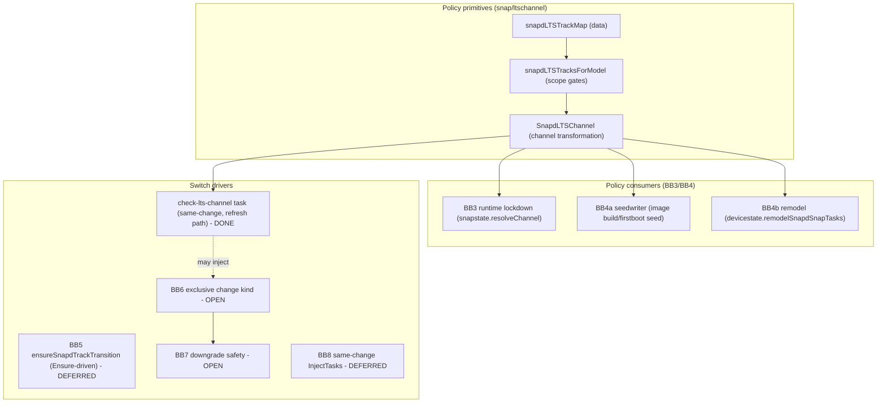

# Design: Force snapd onto ESM track (UC042 spike)

Status: Spike / exploratory design
Related specs:
- UC042 "Snapd ESM tracks for Ubuntu Core" (the concise mechanism spec)
- UC039 "Ubuntu Core Support Process" (the lifecycle/process context)

This document captures the gap analysis, the snapd-behaviour investigation that
grounds it, the functional decomposition into building blocks, and the decisions
that led to the implementation plan at the end.

---

## 1. Problem statement

Ubuntu Core is moving to per-version snapd tracks. When a UC version reaches
year 6 (ESM-equivalent), snapd must transition from `latest/<risk>` to
`<UC-version>/<risk>` (e.g. `18/stable`, `22/edge`) and follow a frozen
`release/lts/<UC-version>` branch instead of master.

We need a mechanism that:
- Forces existing in-field devices onto the track matching their UC version.
- Switches snapd's track **before any other snap updates are applied**
  (UC039 requirement).
- Locks down which snapd tracks may be used (pre-ESM: only `latest`;
  post-ESM: only that UC version's track).
- Reinterprets old model assertions so they remain valid.

---

## 2. What UC042 specifies (summary)

- snapd holds a compiled-in map of ESM UC versions -> snapd tracks, updated when
  a snapd version becomes the ESM version for a UC release.
- On install/refresh, snapd finds the UC release from the model boot base
  (18, 20, ... via the running UC version, not the snapd build base), combines it
  with the current risk, and switches track (snapd uses track/risk only).
- When an "unaware" snapd refreshes to an "aware" one (or an aware one is started
  on installation), the aware snapd switches to the ESM track and refreshes to the
  snapd found there, "in the same change by the new snapd inserting tasks as it
  starts to run".
- Unasserted snapd: `--amend` only allowed onto the ESM track; unasserted snaps
  skip the lockdown check.
- Model `default-channel: latest/<track>` is reinterpreted by an ESM (or newer)
  snapd as `<UC_version>/<track>`, at image build and remodel.
- Pre-ESM UC versions cannot use non-`latest` tracks; ESM UC versions cannot use
  tracks other than their own. FIPS will later need new track-name behaviour.

---

## 3. snapd behaviour investigation (grounding)

All claims below were verified against the codebase.

### 3.1 snapd-first ordering and self-modifying changes
- snapd sorts ahead of everything via `typeOrder` (`TypeSnapd: 0`) in
  [snap/types.go](snap/types.go); `doUpdate` sorts updates by type
  ([overlord/snapstate/snapstate.go](overlord/snapstate/snapstate.go)).
- Cross-snap ordering is wired in `arrangeRebootAndUpdateSeed`
  ([overlord/snapstate/reboot.go](overlord/snapstate/reboot.go)): snapd's task set
  goes first and every other snap's first task waits on the final snapd task.
- A running handler can append tasks to its own in-flight change via
  `InjectTasks` and the `chg.AddAll(...)` + `st.EnsureBefore(0)` pattern
  (`doCheckReRefresh`, `doConditionalAutoRefresh` in
  [overlord/snapstate/handlers.go](overlord/snapstate/handlers.go)).
- After a snapd-snap refresh, `link-snap` requests a daemon restart; the change is
  persisted and resumes under the new snapd, guarded by `FinishRestart`
  ([overlord/snapstate/snapstate.go](overlord/snapstate.go)).
- Cross-snap ordering (other snaps wait on snapd's final task) is separate from
  restart type: snapd is excluded from the essential-snap **system reboot**
  boundaries in `arrangeRebootAndUpdateSeed` ([overlord/snapstate/reboot.go](overlord/snapstate/reboot.go)).

#### Restart vs reboot when snapd is involved

`arrangeRebootAndUpdateSeed` controls **task ordering** and **system reboot**
boundaries for boot participants (base, gadget, kernel). Snapd install/refresh
uses `finishTaskWithMaybeRestart` in [overlord/snapstate/handlers.go](overlord/snapstate/handlers.go)
for **daemon restart** at `link-snap`. Do not assume a snapd change always
reboots the machine.

| Scenario | Daemon restart? | System reboot? |
|----------|-----------------|----------------|
| snapd snap install/refresh (normal) | Yes (at `link-snap`) | No (by itself) |
| snapd + gadget/kernel/base in same change | Yes for snapd | Maybe (from essentials / seed-refresh) |
| Preseed | No (deferred to first boot) | N/A |

Within snapd's own task set, the daemon restart happens at `link-snap`; remaining
snapd tasks (e.g. `setup-profiles`, `auto-connect`) then run under the new snapd
before other snaps' tasks start.

### 3.2 Model base -> UC version
- `naming.CoreVersion(base)` parses `core`->16, `core18`->18, etc.
  ([snap/naming/core_version.go](snap/naming/core_version.go)).
- The model is reachable at runtime via `DeviceCtx(...).Base()`
  ([overlord/devicestate/devicectx.go](overlord/devicestate/devicectx.go)).
- Existing precedent for gating behaviour on UC version: `configcore/motd.go`,
  `config/transaction.go`, `image/image_linux.go` all call `naming.CoreVersion`.
- The snapd tracking channel lives in `SnapState.TrackingChannel`
  ([overlord/snapstate/snapmgr.go](overlord/snapstate/snapmgr.go)); there is no
  code today that derives snapd's refresh channel from the model base.

### 3.3 Channel/track validation and switching
- `channel.Channel` (track/risk/branch) parsing and `Resolve`/`ResolvePinned`
  in [snap/channel/channel.go](snap/channel/channel.go).
- `resolveChannel` ([overlord/snapstate/snapstate.go](overlord/snapstate/snapstate.go))
  is the central model-constraint check, but it only pins **kernel** and **gadget**
  tracks. The snapd snap is unguarded.
- Image build channel resolution: `Writer.resolveChannel`
  ([seed/seedwriter/writer.go](seed/seedwriter/writer.go)).
- Remodel channel resolution: `modelSnapChannelFromDefaultOrPinnedTrack` and
  `remodelSnapdSnapTasks`
  ([overlord/devicestate/devicestate.go](overlord/devicestate/devicestate.go)).

### 3.4 amend / unasserted snaps
- `Flags.Amend` ([overlord/snapstate/flags.go](overlord/snapstate/flags.go))
  consumed in `installActionsForAmend`
  ([overlord/snapstate/storehelpers.go](overlord/snapstate/storehelpers.go)):
  emits an `install` store action keyed by name+epoch (no snap-id) for unasserted
  snaps, turning them asserted.
- Asserted vs unasserted is determined by empty `SideInfo.SnapID`; sideloaded
  revisions are negative (`Revision.Local()`).
- Normal refresh ignores snaps with empty SnapID, so an unasserted snapd can only
  move to an asserted store revision via `--amend`.

### 3.5 Existing field track-switch mechanisms (verdict)
- Local admin `snap switch/refresh snapd --channel=...`: **works today, no guard.**
- Remodel to a model with snapd `default-channel`: **works** (signed model).
- Store `redirect-channel`: honored on install/seed, **ignored on refresh** ->
  cannot move an installed device's track.
- Gadget defaults, validation sets, snap-declaration, cohorts: **cannot** change a
  track.
- Conclusion: no automatic/store-driven path exists; new snapd logic is required,
  and the lockdown is net-new.

### 3.6 Downgrade tolerance
- Hard floor: `patch.Level`. If the target (frozen LTS) snapd was built with a
  lower major `Level` than what wrote `state.json`, it refuses to start
  (`"cannot downgrade: snapd is too old for the current system state"`) -
  [overlord/patch/patch.go](overlord/patch/patch.go). Sublevel diffs are tolerated.
- Epoch: snapd declares no epoch today. If ever bumped, `checkEpochs` permanently
  blocks downgrade below the bump - a one-way door.
- No version-string guard blocks downgrade; version comparisons only trigger
  cleanup (namespace/AppArmor discard) in `doLinkSnap`.
- Safety net: `snap-failure` reverts to the prior revision and `FinishRestart`
  reports `"there was a snapd rollback across the restart"`, driving undo.

### 3.7 Ensure/StartUp-driven changes, conflicts, pruning
- Best template: `ensureUbuntuCoreTransition`
  ([overlord/snapstate/snapmgr.go](overlord/snapstate/snapmgr.go)) - seeded gate,
  in-flight gate, persisted backoff timestamp + retry counter, conflict-tolerant
  taskset build, `NewChange` + `AddAll`.
- Exclusive changes: `checkChangeConflictExclusiveKinds`
  ([overlord/snapstate/conflict.go](overlord/snapstate/conflict.go)) lets a change
  kind (e.g. `remodel`, `transition-to-snapd-snap`) block all other changes until
  ready. `CheckChangeConflictRunExclusively` creates one only when idle.
- Pruning: changes are removed after `pruneWait` (24h ready), stuck non-ready
  changes have unready lanes aborted after `abortWait` (72h), and a 500-change cap
  applies ([overlord/overlord.go](overlord/overlord.go),
  [overlord/state/state.go](overlord/state/state.go)). Restart-waiting changes are
  protected via `RegisterPendingChangeByAttr`. Implication: retry state must be
  anchored in a persisted key, not in the change object.

---

## 4. Gap analysis (Step 1)

1. **ESM map shape and bootstrap.** Is it a set of UC versions or a
   version->track map (matters for FIPS)? The map must be maintained on
   `master`/`latest` (so field devices ever become aware) and on each LTS branch;
   this maintenance coupling is not called out in the spec.
2. **UC version determination + special cases.** Feasible via
   `naming.CoreVersion`, but UC16 / `core`-acts-as-snapd is excluded by UC039 and
   not addressed by UC042; classic/hybrid must not misfire.
3. **Switch trigger.** No existing "after snapd refreshed, now running new snapd"
   hook. Need to decide injection point. Spec only describes same-change injection;
   seeding, retry, and missed-switch cases also need covering.
4. **snapd downgrade (biggest risk).** latest moves ahead of the frozen LTS track,
   so the switch can be a downgrade. Spec is silent. Constrained by `patch.Level`
   and epoch (Section 3.6).
5. **Risk preservation and target existence.** Snapd channels are track/risk
   only (UC039; same as system snaps). Branches are dropped on transition with a
   closed-channel notice. Target risk may not exist on the UC track; need a
   fallback.
6. **Track lockdown.** Net-new; must be enforced consistently in snapstate, image
   build, and remodel; must skip unasserted snapd; must be FIPS-extensible.
7. **Model default-channel reinterpretation.** Terminology ambiguity
   (`latest/<track>` likely means `latest/<risk>`); must apply at image build,
   remodel, and firstboot seeding; snapd-only.
8. **Failure/undo/rollback.** Undo must restore the original `latest/...` channel;
   failed ESM snapd must roll back cleanly. **Open:** when injected switch+refresh
   fails inside a multi-snap change, whether the whole change (including refresh-1
   and other snaps) is undone vs only the switch leg is cancelled — see open
   questions below.
9. **Scope.** Mechanism is for in-place transition; new ESM images get the right
   snapd directly. Recovery re-seeds and re-switches.

### Cases the mechanism must cover
1. Existing device, auto-refresh pulls an aware snapd + other snaps - switch
   before others update.
2. Existing device already on an aware snapd that never switched - self-heal.
3. First boot from an old-model image on an ESM UC version - switch after seeding.
4. First boot from a correctly-built ESM image - no switch needed.
5. Remodel to a different UC version - track follows new model.
6. Admin sets a non-permitted track - lockdown rejects.
7. Unasserted snapd - lockdown skipped; `--amend` only onto ESM track.
8. UC16 / `core`-acts-as-snapd - excluded.
9. Classic / hybrid - excluded.
10. Switch fails / aborted / pruned - retry with backoff.
11. Target track patch-level-incompatible - hold or rely on revert.
12. Target risk missing on UC track - fallback.

---

## 5. Functional analysis (Step 2): mechanisms and building blocks

The mechanism is decomposed into two on-line policy primitives, three policy
consumers, and a set of switch drivers (one done, three open, one deferred).



### 5.1 Policy primitives (`snap/ltschannel`)

Two files; one exported function.

| File | Role |
|------|------|
| [`policy.go`](snap/ltschannel/policy.go) | Data (`snapdLTSTrackMap`), scope flags (`supportUbuntuCore`/`supportClassic`/`supportHybridClassic`), merged scope gate (`snapdLTSTracksForModel`), test mocks (`MockSnapdLTSTrackMap`, `MockSnapdLTSDeviceKindScope`) |
| [`ltschannel.go`](snap/ltschannel/ltschannel.go) | `SnapdLTSChannel` — the sole public API |

**Data shape:** `snapdLTSTrackMap` is `map[int]map[string]string`. Outer key
is boot base (UC version); inner map is **input track → LTS target track**.
The production map is intentionally empty until the first UC version reaches
LTS. Example for an onboarded version:

```go
18: {
    "latest":       "18",
    "fips-updates": "18-fips",
    "18":           "18",      // identity allow
    "18-fips":      "18-fips", // identity allow
}
```

**Merged scope gate (`snapdLTSTracksForModel`)** returns
`(tracks, applies, err)`. Single source of truth for policy applicability:

- Device-kind gate (per scope flags) → `applies=false` when out of scope
  (e.g. classic by default).
- Non-core base (`model.CoreVersion` err) → `applies=false`.
- UC16 (`bootBase == 16`) → **hard error** `cannot use unsupported Ubuntu
  Core 16 model`.
- Boot base not in `snapdLTSTrackMap` → `applies=false` (unmanaged /
  not-yet-onboarded).
- Otherwise → `(tracks, true, nil)`.

**Channel transformation (`SnapdLTSChannel(model, channel)`):**

- `nil` model → error.
- Calls `snapdLTSTracksForModel`; on `err` propagates; on `!applies` returns
  the input channel unchanged.
- Parses channel, normalises empty track to `"latest"`, looks up input track
  in `tracks`.
- Unknown input track for a managed boot base → **error** `cannot resolve
  LTS channel for track "X"`.
- Known input track → swap track to LTS target, **preserve risk**, **drop
  branch**, return cleaned channel.

**Maintenance coupling:** updates to `snapdLTSTrackMap` ship on master and
are backported wholesale to `release/lts/*` so LTS-branch snapd is coherent
with master.

### 5.2 Policy consumers

| BB | Where | What it does |
|----|-------|--------------|
| **BB3** runtime lockdown | `overlord/snapstate/snapstate.go:resolveChannel` (and `target.go` callers) | For snapd installs/switches/refreshes with a non-empty SnapID, calls `SnapdLTSChannel` and compares input vs output; errors `cannot use snapd channel "X": LTS policy requires "Y"` if a remap would silently change the channel. Skipped for unasserted snapd (empty SnapID, via `snapIDForSnapdChannelLockdown`). The narrower error from `SnapdLTSChannel` itself (unknown track) also surfaces here for managed boot bases. |
| **BB4a** image/firstboot seed | `seed/seedwriter/writer.go:resolveChannel` | For snapd in the seed, calls `SnapdLTSChannel(w.model, resChannel)` after the standard channel resolution. Bakes the LTS-remapped channel into `seed.yaml`. Skips for: unasserted snapd in model, path-provided snapd, **UC16 models** (base `core` or empty — no separate snapd snap to LTS-track). |
| **BB4b** remodel | `overlord/devicestate/devicestate.go:remodelSnapdSnapTasks` | For the new model's snapd default-channel, calls `SnapdLTSChannel(rm.newModel, newSnapdChannel)` (skipped if snapd is unasserted in new model). The remapped channel feeds `maybeInstallOrUpdate`, which dispatches to Switch / Install / Update. Unknown-track or UC16 errors fail the remodel at task-build time before any state change. |

### 5.3 The same-change driver (`check-lts-channel`)

Implemented; first-class mechanism alongside BB3/BB4. Lives in
[`overlord/snapstate/handlers_lts_channel.go`](overlord/snapstate/handlers_lts_channel.go).

- **`appendCheckLTSChannelAtEndOfSnapdRefresh`** appends a
  `check-lts-channel` task at the end of any snapd refresh task set in
  `doUpdate`. Gated by `up.SnapState.IsInstalled()` (refresh path only, not
  first install).
- The task runs **under the new snapd** after `link-snap`'s daemon restart,
  at the tail of snapd's post-link work. Other snaps in the same change wait
  on it (cross-snap ordering — it is `finalSnapdTask`).
- Handler `doCheckLTSChannel` calls
  `SnapdLTSChannel(model, snapst.TrackingChannel)`. If equal → no-op, task
  done. If different → calls `updateManyFiltered` to produce a switch+refresh
  task set targeting the LTS channel, `chg.AddAll`s it into the same change,
  persists the injected task IDs in the task data, and returns `state.Retry`
  until those tasks reach Done.
- On injected task ErrorStatus the handler hard-errors. Today this fails
  the parent change (policy A — see §6 open questions).
- Older snapd no-ops unknown tasks, preserving forward compatibility.

### 5.4 Open drivers

- **BB5 `ensureSnapdTrackTransition`** — `SnapManager.Ensure`-driven safety
  net for the cases the same-change driver cannot reach (no refresh in
  flight, snapd already at newest revision on wrong channel, prior switch
  failed and pruned). **Status:** deferred pending spread-test evidence; see
  §6.
- **BB6 exclusive change kind** — register a snapd-LTS-switch change kind
  in `checkChangeConflictExclusiveKinds`; required for any free-standing
  switch change not nested inside a parent refresh (or if BB5 lands).
- **BB7 downgrade safety** — newest-on-track selection, pre-flight
  `patch.Level` guard, undo restores original channel. Failure-scope
  decision (§6) gates BB7's undo story.
- **BB8 same-change `InjectTasks`** — UC042's literal-text mechanism;
  deferred unless spike proves per-cycle strictness is required.

### 5.5 Coverage map

How each §4 case is currently handled:

| # | Case | Covered by |
|---|---|---|
| 1 | Auto-refresh pulls aware snapd + other snaps | `check-lts-channel` (same change as refresh-1) |
| 2 | Aware snapd already installed, never switched | Refresh-retry self-healing (next snapd revision triggers refresh → `check-lts-channel`). BB5 would be belt-and-suspenders |
| 3 | First boot from old-model image on ESM UC | Refresh-retry self-healing (first auto-refresh post-firstboot). See §5.6 |
| 4 | First boot from correctly-built ESM image | BB4a at image build → `seed.yaml` carries LTS channel → firstboot is a no-op for LTS. See §5.6 |
| 5 | Remodel to different UC version | BB4b in `remodelSnapdSnapTasks` + the refresh-path `check-lts-channel`. See §5.7 |
| 6 | Admin sets non-permitted track | BB3 input-vs-output compare → error |
| 7 | Unasserted snapd / `--amend` | BB3 skipped via `snapIDForSnapdChannelLockdown(... fromPath, "")`; `--amend`-onto-ESM constraint not yet implemented |
| 8 | UC16 / `core`-acts-as-snapd | UC16 hard error in `snapdLTSTracksForModel` + seedwriter UC16 skip |
| 9 | Classic / hybrid | Scope flags (default `false`) |
| 10 | Switch fails / aborted / pruned | `check-lts-channel` hard-errors; parent change errors; auto-refresh `RefreshFailures` backoff retries when next snapd revision lands. BB5 would close the long-tail gap |
| 11 | Target track patch-level-incompatible | **Open** — BB7 |
| 12 | Target risk missing on UC track | **Open** — BB7 |

### 5.6 Firstboot trace

`overlord/devicestate/firstboot.go:populateStateFromSeedImpl` reads the seed
and calls `installSeedSnap` per snap, which uses `pathInstallGoal` +
`snapstate.InstallOne`. For snapd this lands in
`target.go:targetForPathSnap` → `resolveChannel` (BB3 fires for asserted
seeded snapd via `snapIDForSnapdChannelLockdown(... fromPath=true)`).

`appendCheckLTSChannelAtEndOfSnapdRefresh` is **not** invoked at firstboot
(`IsInstalled() == false`).

Three sub-cases:

| | What happens at firstboot | Reconciliation |
|---|---|---|
| **Case 4** (ESM image) | BB4a already wrote LTS channel into `seed.yaml`; firstboot install is a no-op for LTS | none needed |
| **Case 3** (old image, LTS not yet known at build) | Seeded snapd's LTS map didn't cover the UC version at image build; BB4a passed through; firstboot installs on `latest/<risk>` | First auto-refresh that pulls a newer LTS-aware snapd triggers `check-lts-channel` → switch+refresh |
| Inconsistent seed (admin/build mistake) | BB4a bypassed or hand-edited; BB3 errors at firstboot: `cannot use snapd channel "X": LTS policy requires "Y"`; firstboot fails loudly | requires image fix |

### 5.7 Remodel trace

`remodelSnapdSnapTasks` (devicestate.go:1073):

1. Compute `newSnapdChannel` (model default or `latest/stable`).
2. **BB4b** remap via `SnapdLTSChannel(rm.newModel, ...)` (skipped if snapd
   unasserted in new model).
3. Dispatch via `maybeInstallOrUpdate`:
   - Not installed → store or path install goal; BB3 fires at `resolveChannel`.
   - Installed, channel-only change → `snapstate.Switch`; BB3 fires; no
     `check-lts-channel` appended (no `doUpdate`).
   - Installed, channel+revision change → `UpdateOne` (refresh path); BB3 +
     `check-lts-channel` appended.
   - No changes → no-op.

Unknown tracks or UC16 in the new model error at step 2, before any state
change.

**Offline remodel** uses path-install goals instead of store goals; the LTS
pipeline is identical. The only edge worth verifying is whether
`check-lts-channel`-driven `updateManyFiltered` honours
`RemodelOptions.Offline` in the unlikely path where injection actually fires
(BB4b should mean the channel is already correct and the injection branch
never executes).

UC-version transitions: BB4b uses `rm.newModel.CoreVersion()`, so snapd
retracks atomically with the remodel.

---

## 6. Decisions and rationale

### Policy primitives

- **Single merged scope gate `snapdLTSTracksForModel`** replaces the earlier
  `SupportsLTSChannels` / `resolveChannelForLTS` split. Returns
  `(tracks, applies, err)` — all four gates (device-kind, non-core base,
  UC16, boot-base presence) live in one place. Future callers (BB5/BB6/BB7)
  get correct gating for free.
- **Flat data shape `snapdLTSTrackMap[bootBase][inputTrack] = targetTrack`**
  replaces the earlier per-base variant-spec map with specificity scoring.
  The spec-map machinery (`specSpecificity`, `variantMatches`, `applyTarget`,
  etc.) is dropped — it was supporting a single contrived test case never
  required by the spec.
- **Unknown track on a managed boot base errors** (does not fall back to a
  default). Callers see `cannot resolve LTS channel for track "X"` and either
  propagate (seedwriter, remodel) or wrap (snapstate.resolveChannel BB3
  compare).
- **Branch dropped on remap.** LTS branches are not guaranteed to exist;
  `parsed.Branch = ""` before returning from `SnapdLTSChannel`.
- **UC16 hard block** in `snapdLTSTracksForModel` (`bootBase == 16` →
  error). Defense-in-depth: any future caller gets the block for free;
  callers that legitimately reach UC16 (firstboot seedwriter) skip the call
  explicitly via `base == "" || base == "core"`.
- **Scope flags configurable.** `supportUbuntuCore` defaults `true`;
  `supportClassic` / `supportHybridClassic` default `false`. Hybrid
  identified via `model.HybridClassic()`. Out-of-scope models are
  passthrough (no error), matching the previous `SupportsLTSChannels = false`
  semantics that downstream callers relied on.
- **Test mocks:** `MockSnapdLTSTrackMap(map[int][]string)` (convenience:
  first track is the `"latest"` target plus identity entries; `-fips` tracks
  auto-add a `fips-updates` alias) and `MockSnapdLTSDeviceKindScope`.
  Symmetric names matching the variables they mock.
- **Package layout:** [`ltschannel.go`](snap/ltschannel/ltschannel.go) holds
  the pure channel transformation; [`policy.go`](snap/ltschannel/policy.go)
  owns data + scope + mocks. No `channel.go`.
- **Sentinel `ErrNoLTSTrack` + typed `*NoLTSTrackError{Track}`** for the
  unknown-track-on-managed-base case, parallel to
  `channel.ErrPinnedTrackSwitch`. Allows BB3 to wrap the rejection as
  `cannot use snapd channel %q: LTS policy rejects track %q` for symmetry
  with the existing `LTS policy requires` wrap; BB4a/BB4b continue to
  bubble the raw error at task-build time.

### Switch driver strategy

- **Same-change driver (`check-lts-channel`) is the primary mechanism.**
  Implemented; covers case 1 directly, case 5 in the refresh-path of remodel,
  and cases 2/3/10 via refresh-retry self-healing.
- **Refresh-retry self-healing is acceptable** for cases 2, 3, and 10:
  - Auto-refresh runs ~4×/day. New snapd revisions on `latest/<risk>` are
    common.
  - LTS map awareness arrives by getting a new snapd. The very refresh that
    introduces awareness for a device's UC version also carries
    `check-lts-channel`, which fires immediately. Self-consistent.
  - Persistent failure devices have larger problems than channel mismatch;
    BB5 would not help them either.
- **BB5 deferred** (see open question 1). May be implemented later if spread
  tests show a real gap.

### Downgrade

- **Newest revision on target track** to minimise delta.
- `patch.Level` is the real floor (snapd refuses to start if too old).
- Epoch is a one-way door — never bump.
- Undo must restore the original channel; `snap-failure` + `FinishRestart`
  form the safety net.

### Maintenance

- **Policy data ships on master and LTS branches.** `snapdLTSTrackMap` is
  backported wholesale to `release/lts/*` so LTS-branch snapd applies its
  own policy coherently.
- **Retry state in a persisted state key**, not on the change object,
  because changes are pruned (24h ready / 72h not-ready / 500-cap).

### Open questions

1. **Is BB5 required?** Given refresh-retry self-healing covers cases
   2/3/10 in practice (analysis in §5.5 and the "Switch driver strategy"
   above), BB5 may be belt-and-suspenders. Decision points:
   - (a) Keep BB5 (most conservative; matches the original DESIGN).
   - (b) Drop BB5 entirely; rely on refresh retries.
   - (c) Defer BB5 until spread tests with "quiet device" simulations show
     whether the gap is real.

   Current direction: **(c)**. Ship `check-lts-channel` + BB6 + BB7; add
   BB5 only if spread data justifies it.

2. **Failure scope of `check-lts-channel` injection.** When the injected
   switch+refresh fails:

   | Policy | On failure | Status |
   |--------|-----------|---|
   | **A. Fail whole change** | All work undone including refresh-1 and other snaps | Today's behaviour, by accident not by decision |
   | **B. Fail switch only** | Refresh-1 stays committed; other snaps may proceed; switch retries via auto-refresh later | Most operationally tolerant; least atomic |
   | **C. Fail switch only, keep change blocked** | Refresh-1 commits; other snaps wait; admin UX unclear | Middle ground |

   Needs spec/product decision before BB7 (undo story) and the
   "failed-switch retry/rollback" spread scenarios.

3. **First install vs refresh only.** `check-lts-channel` is appended only
   when `SnapState.IsInstalled()` (refresh path). Firstboot relies on BB4a
   + refresh-retry self-healing. §5.6 shows this works for the three
   sub-cases. Open whether first install should also append the check for
   stricter same-boot atomicity.

4. **Patch-level incompatibility** — pre-check + hold vs rely on
   `snap-failure` revert. Affects BB7.

5. **Target risk missing on UC track** — fallback behaviour undefined.

6. **`--amend`-only-onto-ESM-track constraint for unasserted snapd** — not
   implemented; lockdown today simply skips unasserted snapd.

7. **`RemodelOptions.Offline` propagation through `check-lts-channel`'s
   injected `updateManyFiltered`** — verify it doesn't attempt store
   access during an offline remodel (BB4b should make this unreachable,
   but worth a short trace).

8. **Spec wording confirmation:** `default-channel: latest/<track>` ==
   `latest/<risk>` → `<UC>/<risk>`.

---

## 7. Implementation plan (sequenced) and status

| Step | Item | Status |
|------|------|--------|
| 0 | `asserts.Model.CoreVersion()` + migrate model-holding callers | **done** |
| 1 | `snap/ltschannel` primitives: flat `snapdLTSTrackMap`, scope flags, merged `snapdLTSTracksForModel`, `SnapdLTSChannel` | **done** |
| 2 | Test mocks `MockSnapdLTSTrackMap` + `MockSnapdLTSDeviceKindScope` | **done** |
| 3 | BB3 runtime lockdown: input-vs-output compare in `snapstate.go:resolveChannel`; `snapIDForSnapdChannelLockdown` for unasserted/path-install skip semantics | **done** |
| 4 | BB4a seedwriter remap (with UC16 skip) | **done** |
| 5 | BB4b remodel remap in `remodelSnapdSnapTasks` | **done** |
| 6 | Same-change driver: `check-lts-channel` task + handler + `appendCheckLTSChannelAtEndOfSnapdRefresh` | **done** |
| 7 | BB6 exclusive change kind for stand-alone switch changes (`swfeats.RegisterChangeKind`, `checkChangeConflictExclusiveKinds`) | **open** |
| 8 | BB7 downgrade safety: newest-on-track, `patch.Level` pre-check, undo restores channel, verify `FinishRestart` rollback | **open** (gated on §6 open Q2 failure-scope decision) |
| 9 | BB5 ensure-driven driver | **deferred** (re-evaluate after spread §10, per §6 open Q1) |
| 10 | Spread validation: existing-device transition; ordering before other snaps; lockdown rejection; image-build track selection; downgrade-across-switch boot; failed-switch retry/rollback; quiet-device gap simulation | **open** |
| 11 | Doc + branch hygiene before PR: split unrelated changes, decide on top-level PDFs/scratch files, doc pass on this file | **open** |
| 12 | BB8 same-change `InjectTasks` for strict per-cycle ordering | **deferred** unless spike shows it's required |
