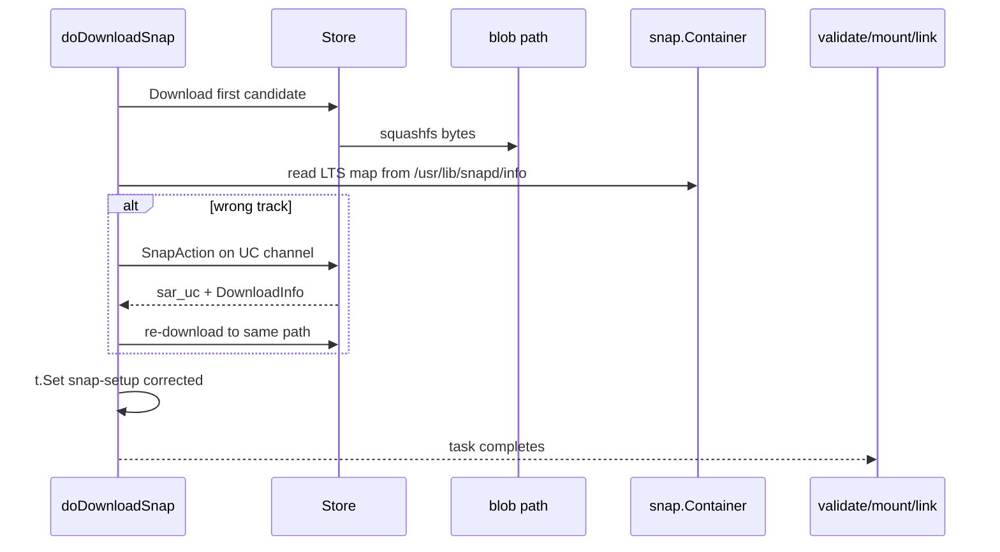

# LTS snapd intercept — focus (SNAPDENG-35854)

Working notes for **metadata-inspect-Q1**: read the LTS track map from inside the
candidate snapd squashfs and redirect to the UC track before wrong-track snapd
is linked.

**Branch:** `ernestl/SNAPDENG-35854/spike-snapd-onto-track` (has `snap/ltschannel`,
BB3/BB4; post-link `check-lts-channel` removed in 67c2385e85).

**Recommended intercept:** `doDownloadSnap` in
[`overlord/snapstate/handlers.go`](overlord/snapstate/handlers.go) — inspect
after download, remap in place before `validate-snap`.

**Rejected approaches:**
- Planning-time probe at `targetFromActionResult` L188 — blocks API/Ensure during
  full download; novel pattern.
- Post-link `check-lts-channel` + `chg.AddAll` — matches UC042 literally but
  links `latest` first, then injects second refresh; state-mutation risk.

---

## Core constraint

LTS mapping is **not** in store catalog (`SnapAction` / `snap-yaml`). It must be
read from inside the candidate snapd snap (precedent: `snap.SnapdInfoFromSnapFile`
reading `/usr/lib/snapd/info`).

Store planning only returns metadata + `DownloadInfo` (URL, hash). The squashfs
bytes are fetched in the `download-snap` task handler.

---

## Recommended approach: in-place remap in `doDownloadSnap`

After blob download, before task completes (snapd only):

1. Open squashfs at `snapsup.BlobPath()`
2. Read LTS map (proposed: `SNAPD_LTS_TRACKS` key in `/usr/lib/snapd/info`)
3. If UC track needed → second `SnapAction` on UC channel → re-download over same path
4. Update `snap-setup` on download task (`SideInfo`, `DownloadInfo`, channel, rev)
5. `validate-snap` → `mount-snap` → `link-snap` see corrected setup via `snap-setup-task`

Precedent: COMPAT path in `doDownloadSnap` when `DownloadInfo == nil` already
re-queries store via `sendOneInstallActionUnlocked` and rewrites `snap-setup`.



**Why this wins:**

| Concern | Handling |
|---------|----------|
| Map only in squashfs | Read after download |
| No planning-time download | Store I/O stays in task handler |
| Wrong track never linked | Remap before `validate-snap` |
| Same change | No injection/discard — same graph, corrected `snap-setup` |

### Fast path (skip peek most of the time)

Only inspect when **all** of:

- `snapsup.Type == snap.TypeSnapd`
- Running snapd's compiled-in map doesn't already resolve the correct channel
- Candidate may be on wrong track (e.g. `latest` bootstrap / Case 3)

If `resolveChannel` → `ltschannel` already targeted UC channel at planning, trust
`DownloadInfo` and skip squashfs read.

### Out of scope for v1 (`doDownloadSnap`)

- Device already on aware snapd at wrong track with **no** refresh in flight
  → deferred BB5 / `Ensure` safety net
- Path install / seeding → do not block firstboot; reconcile on first store refresh

---

## Path coverage

| Path | Trigger | LTS peek in `doDownloadSnap`? | Notes |
|------|---------|-------------------------------|-------|
| Store **install** | `InstallWithGoal` | **Yes** (when gated) | `target.go:430` → normal download pipeline |
| Manual/auto **refresh** | `UpdateWithGoal` | **Yes** (when gated) | `storehelpers.go:591` |
| **Path install** (seed, sideload) | `targetForPathSnap` | **No** | Offline fixed blob; don't block seeding |
| **Local revision refresh** | `targetFromLocalSnapWithStoreComponents` | **No** | Rev already on disk |
| **`Switch`** | `Switch` → `resolveChannel` | **No** | Lockdown only; refresh is separate |
| **Remodel snapd** | `remodelSnapdSnapTasks` | Indirect | BB4b pre-remap at planning; then store path |

**Compiled-in policy** (complementary): `RevOpts.resolveChannel` → `ltschannel`
at `validateAndInitStoreUpdates` / `validateAndPrune` L784.

---

## Same-change / injection (deferred)

UC042: "new snapd inserts tasks in the same change" — describes post-link
`check-lts-channel` + `chg.AddAll` (two snapd refreshes: latest → aware → UC track).

Snapstate has no happy-path "discard and replace" task graph primitive. Injection
is additive only (`chg.AddAll`, `InjectTasks`). Prerequisites explicitly skip snapd.

Post-link injection abandoned on spike branch; revisit only if in-download remap
cannot cover a proven gap.

---

## Implementation plan

Work on spike branch `ernestl/SNAPDENG-35854/spike-snapd-onto-track`.

### Step 1 — Metadata contract

Agree on-disk format in candidate snapd snap, e.g.:

```
SNAPD_LTS_TRACKS='{"18":{"latest":"18",...}}'
```

Mirror `snapdLTSTrackMap` shape in `snap/ltschannel/policy.go`. May need
`data/info` / `mkversion.sh` / snapcraft changes in parallel.

### Step 2 — Read helper (unit tests first)

`ltschannel.SnapdLTSTracksFromSnapFile(snap.Container)` using `squashfs.New(path)`
+ `ReadFile`. Tests with fake squashfs; no store/state.

### Step 3 — `doDownloadSnap` branch

After successful download, snapd-only gated inspect → remap → rewrite `snap-setup`.
Handler tests with `fakeStore` + test squashfs.

### Step 4 — Fast-path gating

`needsLTSMapInspect(snapsup, deviceCtx)` to avoid opening squashfs on every snapd refresh.

### Step 5 — Docs

Keep this file and `DESIGN.md` aligned with the `doDownloadSnap` intercept.

### Step 6 — Spread

Case 3 bootstrap: old snapd on `latest`, candidate carries map, single change
lands on UC track without linking wrong rev.

### PR split

1. Metadata read helper + `data/info` key + unit tests
2. `doDownloadSnap` remap + handler tests
3. Fast-path gating + spread

### Open decision

If peek fails (map missing/corrupt): block refresh vs fall back to compiled-in
`ltschannel` only?
