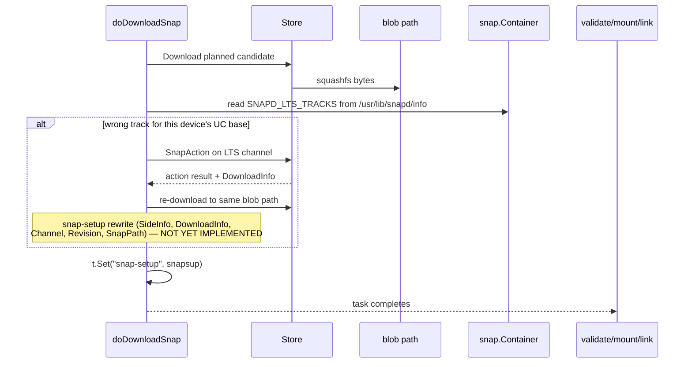

# LTS snapd intercept — focus (SNAPDENG-35854)

Short-form description of the chosen mechanism and immediate next steps.
Long-form rationale in [DESIGN.md](DESIGN.md) (see especially §5.4
"download-stage driver" and Appendix "Rejected approaches").

**Branch:** `ernestl/SNAPDENG-35854/spike-snapd-onto-track`.

**Mechanism in one line.** Read the LTS track map from inside the
*candidate* snapd squashfs in `doDownloadSnap`; if it disagrees with the
planned channel for the device's UC base, issue a second `SnapAction` on
the LTS channel, re-download over the same blob path, and rewrite
`snap-setup` in place so `validate-snap → mount-snap → link-snap` complete
on the corrected track. No task-graph mutation; no two-stage refresh; one
change, one snapd revision linked.

---

## Core constraint

LTS mapping is **not** in store catalog (`SnapAction` / `snap-yaml`). It
must be read from inside the candidate snapd snap. Precedent:
`snap.SnapdInfoFromSnapFile` reading `/usr/lib/snapd/info`. The proposed
key is `SNAPD_LTS_TRACKS` (JSON value).

Store planning only returns metadata + `DownloadInfo` (URL, hash). The
squashfs bytes are fetched in the `download-snap` task handler — that is
where we get to look at the map for the first time.

---

## The intercept: in-place reroute in `doDownloadSnap`

After blob download, before the task persists the updated `snap-setup`
(snapd only, asserted only, model available):

1. Open squashfs at `snapsup.BlobPath()` (`squashfs.New(path)`).
2. Read LTS map via `snap.SnapdLTSTrackMapFromSnapFile`
   (parses `SNAPD_LTS_TRACKS`).
3. Call `ltschannel.SnapdLTSChannel(model, snapsup.Channel, container)`.
4. If the resulting LTS channel differs from `snapsup.Channel`:
   1. Issue a second `SnapAction` on the LTS channel (same pattern as
      `doDownloadSnap`'s existing COMPAT branch:
      `sendOneInstallActionUnlocked`).
   2. Re-download to the same blob path; honour checksum / integrity /
      `DownloadInfo` from the new action.
   3. Update `snapsup` in place: `SideInfo` (new SnapID / Revision),
      `DownloadInfo`, `Channel`, `Revision`, `SnapPath`.
5. `t.Set("snap-setup", snapsup)` as today.
6. `validate-snap` → `mount-snap` → `link-snap` see the corrected setup
   via `snap-setup-task` with no graph mutation.

Precedent: the COMPAT path already in `doDownloadSnap` (`DownloadInfo == nil`
branch) re-queries the store and rewrites `snap-setup`. The reroute is
the same shape with a different trigger and an extra re-download.



**Why this approach wins:**

| Concern | Handling |
|---------|----------|
| Map only inside the snap squashfs | Read after download |
| No store I/O at planning time | Store calls stay in the task handler |
| Wrong-track snapd never linked | Reroute happens before `validate-snap` |
| Single change | No injection; same task graph; corrected `snap-setup` |
| Cross-snap ordering | Free via `typeOrder` + `arrangeRebootAndUpdateSeed` |
| Compatibility | Older snapd never reroutes, but is also never LTS-aware on other paths — no regression |

### Fast path (skip squashfs read most of the time)

Only inspect when **all** of:

- `snapsup.Type == snap.TypeSnapd`
- `snapsup.SideInfo.SnapID != ""` (asserted)
- model is available
- the planned channel is not already on an LTS track per the **running**
  snapd's view (i.e. `SnapdLTSChannel(model, snapsup.Channel, nil)` would
  agree)

If the running snapd's view says the planned channel is already correct,
trust `DownloadInfo` and skip the squashfs open.

### Out of scope for v1

- "Aware snapd already installed at wrong track with no refresh in flight"
  → deferred to BB5 (Ensure-driven safety net), re-evaluate after spread.
- Path install / seeding → do not block firstboot; reconcile on first
  store-driven refresh.

---

## Path coverage

| Path | Trigger | LTS peek in `doDownloadSnap`? | Notes |
|------|---------|-------------------------------|-------|
| Store **install** | `InstallWithGoal` | **Yes** (when gated) | normal download pipeline |
| Manual/auto **refresh** | `UpdateWithGoal` | **Yes** (when gated) | normal download pipeline |
| **Path install** (seed, sideload) | `targetForPathSnap` | **No** | offline fixed blob; don't block seeding |
| **Local revision refresh** | `targetFromLocalSnapWithStoreComponents` | **No** | revision already on disk |
| **`Switch`** | `Switch` → `resolveChannel` | **No** | lockdown (BB3) only; no download task |
| **Remodel snapd** | `remodelSnapdSnapTasks` | Indirect | BB4b pre-remap at planning; then store path goes through `doDownloadSnap` |

**Compiled-in policy (planning side, complementary):**
`RevOpts.resolveChannel` → `ltschannel` at `validateAndInitStoreUpdates` /
`validateAndPrune`. Consults the **running** snapd's map (candidate=nil).
Best-effort; the download intercept is the real enforcement.

---

## Implementation plan

Work on spike branch `ernestl/SNAPDENG-35854/spike-snapd-onto-track`.

### Step 1 — Metadata contract  *(open)*

Agree on-disk format in the candidate snapd snap. Proposed:

```
SNAPD_LTS_TRACKS='{"18":{"latest":"18","fips-updates":"18-fips","18":"18","18-fips":"18-fips"}}'
```

Mirror `SnapdLTSTrackMap` shape in `snap.parseSnapdLTSTracks`. Needs
parallel changes in `data/info` / `mkversion.sh` / snapcraft so the key
actually lands in the built snap.

### Step 2 — Read helper  *(done)*

`snap.SnapdLTSTrackMapFromSnapFile(snap.Container)` reads
`/usr/lib/snapd/info` via `SnapdInfoFromSnapFile`, parses
`SNAPD_LTS_TRACKS` via `parseSnapdLTSTracks`. Unit-tested.

Companion `snap.SnapdLTSTrackMapFromThis()` reads the same key from the
*running* snapd's info file via `snapdtool.InternalLibExecDir` +
`snapdtool.SnapdVersionFromInfoFile`. Used by planning consumers
(BB3/BB4a/BB4b).

### Step 3 — `doDownloadSnap` branch  *(scaffolded, log-only)*

`overlord/snapstate/handlers_lts_download.go` currently:
- `needsSnapdLTSChannelResolve(snapsup, model)` — gates on type/SnapID/model.
- `inspectSnapdLTSAfterDownload(snapsup, model, blobPath)` — opens
  squashfs, calls `SnapdLTSChannel(..., container)`, compares to current
  channel, returns `snapdLTSInspectResult`.
- `maybeInspectSnapdLTSAfterDownload(...)` — wires the above and, on
  remap-needed, **logs only** via `logger.Noticef`.

**Still TODO** for the reroute to actually fire:
- Second `SnapAction` on the LTS channel (use store helpers patterned on
  the existing COMPAT branch, e.g. `sendOneInstallActionUnlocked`).
- Re-download to the same blob path; respect checksum / `DownloadInfo`.
- Rewrite `snapsup.SideInfo`, `snapsup.DownloadInfo`, `snapsup.Channel`,
  `snapsup.Revision`, `snapsup.SnapPath`.
- Handler-level unit tests with `fakeStore` and a test squashfs.

### Step 4 — Fast-path gating  *(open)*

`needsSnapdLTSChannelResolve` should additionally check whether
`SnapdLTSChannel(model, snapsup.Channel, nil)` (running snapd view)
already agrees with `snapsup.Channel`; if so, skip the squashfs open. Most
production refreshes will hit this fast path.

### Step 5 — Docs  *(in progress)*

Keep this file and `DESIGN.md` aligned. This update reflects the
download-intercept direction and the abandoned approaches now in
DESIGN.md Appendix.

### Step 6 — Spread  *(open)*

Case 3 bootstrap (priority): old snapd on `latest`, candidate carries
map, single change lands on UC track without ever linking the wrong rev.

Other scenarios: ordering before other snaps; BB3 lockdown rejection;
image-build track selection (BB4a); downgrade across reroute boot;
missing-map fallback behaviour.

### PR split sequence (target)

1. Metadata contract + `data/info` key + running-snapd map reader + unit tests.
2. Candidate map reader + `snap/ltschannel` primitives + BB3/BB4a/BB4b
   planning consumers.
3. `doDownloadSnap` reroute (full implementation, not the scaffold) +
   handler tests + spread.
4. Fast-path gating.
5. BB7 downgrade safety (if accepted).

Before any PR can land: see DESIGN.md §7 step 15 — the spike branch
carries many unrelated changes that must be split off (sandbox/ebpf,
seclog, ctlcmd, fakestore debug, features/query_features, deleted main
tests, and others).

---

## Open decisions

1. **Missing or corrupt candidate map.** When the squashfs has no
   `SNAPD_LTS_TRACKS` key, or it parse-fails, or the device's UC base
   has no entry: block the refresh, fall back to the running snapd's
   compiled-in map, or pass through (no reroute)? Likely fall-back for
   production; force the failure mode explicitly in spread.
2. **Downgrade refused by `patch.Level`.** Pre-flight the rerouted
   revision against `patch.Level` and refuse the reroute before
   re-download commits (cleaner UX) vs accept and rely on `snap-failure`
   revert at restart (simpler code).
3. **BB3 lockdown UX vs candidate authority.** BB3 may reject a track
   that the running snapd doesn't know about but a future candidate would
   accept. Options: keep strict (status quo, document); relax to warn-only;
   or skip BB3 when `SnapdLTSChannel` returns `LTSNoTrackError` (assume
   the candidate may know better).
4. **Re-download bandwidth.** Tolerate the double download for v1.
   Follow-up: metadata-only pre-fetch (e.g. just the `info` file) or a
   store hint analogous to `redirect-channel` but honoured on refresh.
