# Snapd Release Overview

This document describes the snapd release process and is primarily intended for release engineers in the snapd team. We include the release process here publicly for both transparency and documentation purposes, though the process requires various administrative privileges unavailable to most.

## Release planning

At the beginning of every six-month cycle, in agreement with stakeholders, snapd creates a release plan that includes estimated start and end dates for releases. Those dates determine what each release contains. If you want particular content to land in a given release, be mindful of snapd's date-driven release process and check the release plan.

*TODO: add a link to the release plan*

## Release process

### Overview

```mermaid
flowchart TD
    classDef decision fill:#F5D699,stroke:#D4A017,color:#000
    classDef qa fill:#FDCFB7,stroke:#E95420,color:#000
    classDef cert fill:#E0C8DE,stroke:#772953,color:#000
    classDef sru fill:#B8CCE4,stroke:#1a4a7a,color:#000
    classDef external fill:#B8DEBB,stroke:#2a7a2a,color:#000
    classDef label fill:#3a3a3a,stroke:#555,color:#ddd

    style t0 fill:#2a2a2a,stroke:#3a3a3a,color:#ddd,font-size:16px
    style t1 fill:#2a2a2a,stroke:#3a3a3a,color:#ddd,font-size:16px
    style t2 fill:#2a2a2a,stroke:#3a3a3a,color:#ddd,font-size:16px
    style t3 fill:#2a2a2a,stroke:#3a3a3a,color:#ddd,font-size:16px
    style t4 fill:#2a2a2a,stroke:#3a3a3a,color:#ddd,font-size:16px
    style w0 fill:#222,stroke:#333
    style w1 fill:#222,stroke:#333
    style w2 fill:#222,stroke:#333
    style w3 fill:#222,stroke:#333
    style w4 fill:#222,stroke:#333

    subgraph t0 [" "]
        T0L["<b>Prepare release content - 1 week</b>"]:::label
        subgraph w0 [" "]
            D1{{"Agree on release content"}}:::decision
        end
    end

    D1 --> RT["Test release"]:::qa

    subgraph t1 [" "]
        T1L["<b>Build beta artifacts - 1 week</b>"]:::label
        subgraph w1 [" "]
            RT
            BS["Build snaps"]:::qa
            BD["Build debs"]:::sru --> QS["QA testing<br/>(snappy-dev/image)"]:::qa
        end
    end
    RT --> BS & BD

    subgraph t2 [" "]
        T2L["<b>Beta testing - 1 week</b>"]:::label
        subgraph w2 [" "]
            QB["QA testing (beta)"]:::qa
            PB["Public testing (beta)"]:::external
            CB["Certification testing (beta)"]:::cert
            DA["Dev autopkgtests<br/>(-proposed)"]:::sru --> IA["Interim/LTS autopkgtests<br/>(-proposed)"]:::sru --> QP["QA testing<br/>(-proposed)"]:::qa
            PD["Public Dev testing<br/>(-proposed)"]:::external
        end
    end
    BS --> PB & CB & QB
    QS --> DA & PD

    PB & CB & QB & QP & PD --> D2{{"Review known issues"}}:::decision

    subgraph t3 [" "]
        T3L["<b>Candidate testing - 1 week</b>"]:::label
        subgraph w3 [" "]
            D2
            PC["Public testing (candidate)"]:::external
            IT["Public Interim/LTS testing<br/>(-proposed)"]:::sru
            DR["Dev release deb<br/>(-updates)"]:::sru
            XD["Start cross distro<br/>release process"]:::sru
        end
    end
    D2 --> PC
    D2 --> IT & DR
    D2 --> XD

    subgraph t4 [" "]
        T4L["<b>Release - 1 week</b>"]:::label
        subgraph w4 [" "]
            SS["Progressive stable release (snap)"]:::external
            IR["Interim/LTS releases deb<br/>(-updates)"]:::sru
        end
    end
    PC --> SS
    IT & DR --> IR
```

```mermaid
%%{init: {'theme': 'dark', 'themeVariables': {'fontSize': '11px'}, 'flowchart': {'padding': 4, 'nodeSpacing': 10, 'rankSpacing': 10}}}%%
flowchart LR
    classDef qa fill:#FDCFB7,stroke:#E95420,color:#000
    classDef cert fill:#E0C8DE,stroke:#772953,color:#000
    classDef sru fill:#B8CCE4,stroke:#1a4a7a,color:#000
    classDef external fill:#B8DEBB,stroke:#2a7a2a,color:#000
    classDef decision fill:#F5D699,stroke:#D4A017,color:#000

    L1["Snapd Team"]:::qa ~~~ L2["Certification Team"]:::cert ~~~ L3["Ubuntu SRU & Snapd Teams"]:::sru ~~~ L4["Canonical & External Stakeholders"]:::external ~~~ L5["Snapd Team Decision"]:::decision
```





### Release output artifacts

The release process produces the following:
- The snapd snap https://snapcraft.io/snapd
- snapd debs https://launchpad.net/ubuntu/+source/snapd/
- GitHub release https://github.com/canonical/snapd/releases
- Cross-distro artifacts https://snapcraft.io/docs/reference/administration/distribution-support/

*Note: documentation is produced separately from the [snap-docs repository](github.com/canonical/snap-docs)*

### Prerequisites

The complete set of prerequisites for all release process steps is as follows:
- permission from snapd manager to release snapd snap to latest/beta
- a GPG key in both [GitHub](https://docs.github.com/en/authentication/managing-commit-signature-verification/adding-a-gpg-key-to-your-github-account) and [Launchpad](https://documentation.ubuntu.com/launchpad/user/how-to/import-openpgp-key/)
- ability to create a release branch and push a tag to the snapd GitHub repository
- snappy-dev group membership in Launchpad
- ability to promote snapd via snapcraft (you can check if you have permission by running `snapcraft status snapd`)
- permission to run autopkgtests in Launchpad (autopkgtest-requesters group membership; request via debcrafters)
- permission to re-trigger failing autopkgtests running on -proposed (request via debcrafters)

# Full Release Process

## Prepare release content

**Time: 1 week**

### Summary

*Note: Leading up to the cut date, the release engineer should ensure that the master branch does not contain broken tests.*

On the cut date, the release engineer creates a new release branch and opens a PR against that branch with changelogs covering all relevant release content. CI testing on that PR kicks off the next phase: building beta artifacts.

### Steps

#### 1. Create release branch

Prerequisites
- release branch creation rights

Create a branch named `release/<version-number>` from the master branch on [github.com/canonical/snapd](https://github.com/canonical/snapd). If you are creating a patch release, do not create a new branch; use the corresponding `release/2.XX` branch instead.

#### 2. Create a new SRU tracking bug in Launchpad

Create the bug under https://bugs.launchpad.net/ubuntu/+source/snapd (and not https://bugs.launchpad.net/snapd)

It should be named `[SRU] <version>`

NOTE: As a general rule, all releases require their own new SRU bug. The exception is patch releases that are intended to supersede a previous release that will not be pursued any further.

Besides listing the Ubuntu release targets in the description, also select them as release targets. To do that, use the "Target to series" link and select the relevant releases. Once selected, they will appear in the table near the top of the page.

Also subscribe relevant parties to the bug. In addition to key stakeholders, subscribe the following:
- [ubuntu-sru](https://launchpad.net/~ubuntu-sru)
- [sru-verification-interest-group-snapd](https://launchpad.net/~sru-verification-interest-group-snapd)

Launchpad SRU Bug description template:

```
New Snapd release <version> is required for <list of short name Ubuntu releases>.

Snapd <version> is the latest upstream release. It follows the previous Ubuntu release snapd <previous release version>.

The Snapd package deviates from the standard SRU process. The following special SRU process was followed: <link to relevant SRU process doc>

Release preparation: <link to release PR>
Release preparation test results: <link to test workflow results in GitHub>  
Failure analysis: <link to comment on PR explaining failures>

Release notes: <link to NEWS.md file from PR>

Please refer to snapd release notes documentation (https://github.com/canonical/snapd/blob/master/RELEASE.md) for details on how this is assembled.

Launchpad bugs addressed: https://launchpad.net/snapd/+milestone/<version>

Content overview:  <summary list of release content>

Areas of potential regressions: <only include if necessary>

Source packages on `ppa:snappy-dev/image` for upload to -proposed:
<list short name releases and the link for their deb packages>

Validation already completed:

- Release preparation test results: <link to release PR run results>
- QA Beta validation <link to beta validation Jira ticket>
- Certification validation: <link to test observer results> (need VPN)

Verification required:

- Verify LP bugs for <list of short name target releases>
- Perform release upgrades from <short name of earliest supported target release> to <short name of latest supported release>
```

##### Notable examples illustrating selected edge cases and fully completed releases:

- [2.74.1 - supersede example](https://bugs.launchpad.net/ubuntu/+source/snapd/+bug/2138629)
- [2.73](https://bugs.launchpad.net/ubuntu/+source/snapd/+bug/2132084)
- [2.70 - unreleased](https://bugs.launchpad.net/ubuntu/+source/snapd/+bug/2112209)
- [2.68](https://bugs.launchpad.net/ubuntu/+source/snapd/+bug/2098137)
- [2.65.1 - Feature freeze exception](https://bugs.launchpad.net/ubuntu/+source/snapd/+bug/2078050)
- [2.61.3 - patch release example](https://bugs.launchpad.net/ubuntu/+source/snapd/+bug/2039017)

#### 3. Curate list of changes for NEWS.md

NEWS.md contains the list of functional changes in each snapd release for snapd developers. The release engineer should carefully review all release content, including anything that will be cherry-picked, and create a clear, comprehensive list of the functional changes included in the release.

NEWS.md properties:
- it should contain a full, linear, historical record of candidate releases
- it should not include tests, non-functional changes, or fixes issued for bugs created inside the same release
- it should cover each externally relevant PR
- comments should be concise and understandable
- summarized comments should be grouped in an order that is helpful to the audience, e.g. new features, bugfixes, and interface changes grouped together
- all comments that share the same theme should contain the same prefix
- interface modifications should contain the "Interfaces" prefix followed by the interface name and formatted as follows `Interfaces: <interface-name>| <comment>`
- all Launchpad bug fixes should be prefixed with `LP: #<lp-number>` before the comment

Steps:
- (Optional) Use a script to gather all PRs in the release and create a spreadsheet to work from to make it easier to group PRs and filter out test-only and non-functional changes.
    ```
    commit_hash_prev=
    commit_hash_curr=
    commit_prev_date=$(git show -s --format=%ci $commit_hash_prev | xargs -I{} date -d "{}" --utc +%Y-%m-%dT%H:%M:%SZ)
    commit_curr_date=$(git show -s --format=%ci $commit_hash_curr | xargs -I{} date -d "{}" --utc +%Y-%m-%dT%H:%M:%SZ)
    gh pr list --limit 500 --repo=canonical/snapd --base=master --state=merged --search "merged:$commit_prev_date..$commit_curr_date" --json number,title,author,mergedAt,labels,files | jq -r 'sort_by(.mergedAt) | reverse | .[] | ["https://github.com/canonical/snapd/pull/" + (.number|tostring), .title, .author.login, (.mergedAt | sub("T"; " ") | sub("Z"; "")), (.labels | map(.name) | join(", ")), (.files | map(.path) | join(", "))] | @csv' > pr_data.csv
    ```
- Ask the relevant feature developers to help summarize grouped comments.
- Go through each PR and note any references to Launchpad bugs. If the PR fixes a bug and the bug is not tagged against the corresponding milestone, add it to the Launchpad bug.
- All Launchpad bugs resolved by the release should be listed with their Launchpad number as follows: `LP: #<lp-number> <rest of comment>`. Each Launchpad bug under the corresponding milestone (`https://Launchpad.net/snapd/+milestone/<version>`) should have an entry. If the list doesn't exactly match, remove the milestone from LP bugs that are not included in the release.

#### 4. Add and fill out SRU test template for each linked bug

Prerequisites:
- The Launchpad release milestone contains all and only Launchpad bugs from the release being prepared.

Modify each SRU bug linked to the release milestone by adding the [SRU test template](https://documentation.ubuntu.com/project/SRU/reference/bug-template/#reference-sru-bug-template) at the beginning of the bug, followed by `---original---` and the original bug's text. Each part of the template should be filled out with relevant information for the bug.

Examples:
- [Bug that is verified using automated snapd testing](https://bugs.launchpad.net/snapd/+bug/2068493)
- [Bug that requires manual verification](https://bugs.launchpad.net/ubuntu/+source/snapd/+bug/2116949)

#### 5. Create release PR

Prerequisites
- Python packages: python-debian, bs4, markdown

The PR should be from a branch created in your own snapd fork against the upstream release branch created in an earlier step. The branch must include at least an updated NEWS.md and changelogs and might additionally contain cherry-picked commits.

Steps:
1. Create a branch on your own snapd fork from the upstream `release/<version>` branch and call it `release-<version>` (e.g. `release-2.61`)
2. If there are commits to include after the release was cut, cherry pick any needed commits:
	- All cherry picked commits should have the "cherry-picked" label added to their merged PR and ensure their milestone is properly set
	- One can update [this query](https://github.com/snapcore/snapd/pulls?q=-label%3Acherry-picked+is%3Apr+milestone%3A2.61+sort%3Aupdated-desc) to see which PRs target the release but have not yet been cherry-picked.
3. Update NEWS.md with the list created in the previous section
4. Generate changelogs using the NEWS.md created in the previous step
	- Run the changelog script as follows: `DEBEMAIL="<name> <email>" release-tools/changelog.py <version> <sru bug number> NEWS.md`
    - Do not commit the generated markdown file `snapd-<version>-GitHub-release.md`. You can use it to help create the GitHub release if needed; otherwise, ignore it.
	- Double-check changed files
		- `git diff | diffstat`
		- `git diff release/2.75 | diffstat` (any recent previous tag will do)
        - The same files should get touched, all within `packaging/tree`.
	- If you are generating changelogs for a version that supersedes a previous version, remove `New upstream releases, LP: #<lp-number>` from the previous version. The `+<ubuntu release>` and the release name from the previous version should match those of the current patch version.
5. Commit NEWS.md and the changelog updates as `release: <version>` on your personal branch
6. Open the PR against `release/<version>`
    - The PR description should be formatted as follows. Only include the cherry-picked section if you have cherry-picked commits:
		```
		DEBEMAIL="<name> <email>" release-tools/changelog.py <version> <sru bug number> NEWS.md
		
		LP bugs: https://launchpad.net/snapd/+milestone/<version>
		SRU bug: https://bugs.launchpad.net/snapd/+bug/<sru bug number>
		Jira: <link to jira ticket>
		
		CHERRY PICKED
		Functional fixes:
		- list of cherry-picked functional fixes
		Test fixes:
		- list of cherry-picked test fixes
		
		Requires rebase merge
		```
7. Add the "Run nested" label, then add the senior engineer and all team members who have content in NEWS.md as reviewers.

## Build beta artifacts

**Time: 1 week**

### Summary

The phase begins by testing the PR created against the release branch at the end of the previous phase. Once tests have either passed or their failure been proven irrelevant, the PR gets merged. After pushing a version tag to that branch, the release engineer then opens and merges a PR against master with the updated changelogs and the git tag. With a release version tag now visible on master, the release engineer builds the snapd snap on Launchpad and the debs locally. Those artifacts are then tested: the snap via snapd beta testing and the debs via autopkgtests in snappy-dev.

### Steps

#### 1. Test release PR and merge it

1. Once the PR is approved, rerun tests as many times as necessary to get past intermittent failures.
2. Once stabilized, analyze test results to ensure all failures are understood and do not have an impact on the release quality. If any failures remain, add a comment on the PR for each failure, explaining its irrelevance.
3. Use rebase-merge to merge the PR into the `release/<version>` branch.

#### 2. Add tag to commit in canonical/snapd repo

Prerequisites: 
- You must already have the same GPG key successfully uploaded to both GitHub and Launchpad
- You must have permissions to push the tag to the canonical/snapd release branch

Push the version tag to the canonical/snapd repo by following the steps:

**IMPORTANT: the tag must be signed with your GPG key uploaded both to GitHub and Launchpad**

1. Pull the release branch with the new commits after the rebase merge
2. `git tag -s 2.XX -m "tagging package snapd version 2.XX"`
3. `git push upstream 2.XX` (assuming canonical/snapd is upstream)

#### 3. Merge changelogs back into master

1. Create a new branch in your fork called `changelogs-<version>` from the tag you just pushed (2.XX)
2. Merge master into the `changelogs-<version>` branch with the `--no-ff` option. If there are conflicts, always choose the changes from master: `git merge --no-ff master`
3. Open a PR to merge into master (be sure to skip spread tests) with the description: `Merge changelogs back into master, please use a regular “merge” to merge it.`
	1. The PR should contain the complete merge history, including the tagged commit
	2. You should use a regular merge commit to merge it (not squash and merge, not rebase and merge)
4. Once merged, the tag's commit should be found on the master branch `git branch --contains <tag/tag-commit>`

#### 4. Create snapd snap builds for `beta/<version>` on Launchpad

**IMPORTANT: Only trigger the snapd snap builds once you see the tag has been imported to Launchpad. The version is derived from the tag, so its absence will incorrectly produce `<version>+git`**

1. Go to https://code.launchpad.net/~snappy-dev/snapd/+git/snapd
2. Click "import now" to import the codebase
3. Click on https://code.launchpad.net/~snappy-dev/snapd/+git/snapd/+ref/release/2.XX and attempt to browse the code. It will probably not work, but if it does work, then you can confirm the presence of the git tag.
4. Go back to the `release/2.XX` branch (https://code.launchpad.net/~snappy-dev/snapd/+git/snapd/+ref/release/2.XX) and click "Create snap package" (https://code.launchpad.net/~snappy-dev/snapd/+git/snapd/+ref/release/2.XX/+new-snap).
5. In a different window, open a [previous package in edit mode](https://launchpad.net/~snappy-dev/+snap/snapd-2.74/+edit), and copy that configuration to the newly created package. Change the recipe name to `snapd-2.XX` and branch name to `release/2.XX`.
6. Once you are done setting it up, save, click on the package (https://launchpad.net/~snappy-dev/+snap/snapd-2.XX), and request builds.
7. Once the builds have completed, ensure the versions are correct by checking `snapcraft status snapd | grep beta/<version>`

#### 5. Release to latest/beta

Prerequisites:
- You have the necessary snapcraft permissions to promote the snapd snap
- You have permission from the snapd manager to promote to latest/beta
- Builds on all architectures have succeeded

Steps:
1. Sync with the QA person on the team in charge of beta testing to make sure we can go to beta. For example, if a previous release has not yet made it to candidate, we would need to hold off on promoting.
2. Find the revisions for the snap you just pushed. It will be `beta/<version>`. You can find the revisions by running `snapcraft status snapd`
3. For each architectural build, you have a unique revision number. You release by running `snapcraft release snapd <revision-number> beta`. You will run that command for each individual revision number.
4. Update internal roadmap tracking, for example by marking Jira epics and releases as completed.
5. Update GitHub milestones to close the released milestone

#### 6. Post-beta steps

1. Let snapd QA know that snapd was promoted to beta so they can verify that testing has started.
2. Contact the assigned tester from cert, clarify timeline and priority, and ask them to contact us immediately for any unexpected issues.
3. Update https://forum.snapcraft.io/t/the-snapd-roadmap/1973 with release notes content, the correct date, and a green checkbox for beta.
4. Once snapd beta testing and certification testing have concluded, sync with snapd QA and promote to candidate.

#### 7. Build snapd debs and tarballs

*Note: It may sometimes be necessary to add content to the debs that is not in the snap (e.g. to fix an autopkgtest). The preferred way of doing so is to open a PR against the release branch with the cherry-picked changes.*

##### Preliminary work

If you have never done this step before, you might need to patch your `gbp` tool:
```
(cd /usr/lib/python3/dist-packages/gbp ; curl 'https://bugs.debian.org/cgi-bin/bugreport.cgi?att=1;bug=894790;filename=gbp-support-symlinks.diff;msg=5' | sudo patch -p2 )
```

If you have never installed snapd build dependencies, after creating the debian directory in the steps below, run
```
sudo apt build-dep .
```

##### Steps
 
1. Check out the `release/<version>` branch
2. Since the `debian` symlink was removed from the source, create the `debian` folder symlink. For resolute: `ln -sfn packaging/ubuntu-26.04 debian` and for all others: `ln -sfn packaging/ubuntu-16.04 debian`
3. Commit the changes, but **do not push**.
4. Run `gbp buildpackage -S --git-ignore-branch --git-no-purge`. The `--git-no-purge` option is important so we correctly retain the source tree. You may also need to specify `--git-ignore-new` if you have untracked files in your local git repo. You should now have a `build-area` folder one directory up.
5. For each target release, update the changelogs in `build-area/snapd-<version>` to reflect that target, then build the package.
	1. Check for the details of the most recent deb release https://launchpad.net/~snappy-dev/+archive/ubuntu/image/+packages?field.name_filter=snapd&field.status_filter=&field.series_filter=
	2. In `debian/changelog` change that entry to reflect the correct version (e.g. `snapd (2.75.1) xenial` -> `snapd (2.75.1+ubuntu26.04) resolute` when building for resolute). If the latest deb package on the PPA is not present in the changelog, add it at the appropriate place. Also change all later changelog entries to reflect the correct version.
		- *NOTE: If you did a re-spin and are releasing multiple versions, remove the `New upstream release` line in the version that never got released*
	3. Build the package from the directory `build-area/snapd-<version>` (`dpkg-buildpackage -S`)
6. Create the source tarballs from the `build-area` directory: `../snapd/release-tools/repack-debian-tarball.sh ./snapd_<version>.tar.xz`

#### 8. Upload tarballs to GitHub release

From the previous step, the `repack-debian-tarball.sh` script will have created the following files:
- `snapd_<version>.no-vendor.tar.xz`
- `snapd_<version>.only-vendor.tar.xz`
- `snapd_<version>.vendor.tar.xz`

1. Create a GitHub release under https://github.com/canonical/snapd/releases, following the example of previous releases. The `changelog.py` script from the changelog generation step creates a markdown file that can be used here, or you can use NEWS.md and `sed`.
2. Upload the three above-mentioned artifacts to that release
3. Save it as a draft. It should only be published when beta testing has completed. Leave "Set as a pre-release" unchecked.

#### 9. Use a testing PPA to test builds and autopkgtests

##### Why do this step?

Once you have uploaded packages to a PPA, there is no going back. You cannot modify the packages. If there is a problem that causes the builds to fail and you've uploaded to snappy-dev, then there's no way to fix the issue beyond incrementing the version. If you upload first to a test PPA, you can fix issues before uploading to snappy-dev without incrementing the version. This step may be skipped in exceptional circumstances.

Prerequisites:
- You have permission to run autopkgtests on Launchpad (membership in autopkgtests-requesters group)

1. In your Launchpad profile (`launchpad.net/~<user-name>`), click on "Create a new PPA" and activate it.
2. Once created, click on "Change details" in the PPA overview page and add the builds that will be performed in snappy-dev (amd64, amd64v3, arm64, armhf, i386, ppc64el, riscv64, s390x)
3. Click also on "Edit PPA dependencies" and add snappy-dev/image dependencies: https://launchpad.net/~snappy-dev/+archive/ubuntu/image and https://launchpad.net/~ubuntu-security/+archive/ubuntu/fde-ice
4. For each package created (found in `build-area`), upload it to your personal PPA (`dput ppa:<launchpad-user>/<ppa-name> snapd_<version>+ubuntu<target-version>_source.changes`)
5. Under the package details section of the testing PPA, you should see the builds in progress.
6. If you have never run autopkgtests, follow instructions in https://documentation.ubuntu.com/project/contributors/bug-fix/run-package-tests/index.html to set up your environment
7. Use `ppa tests --show-url ppa:<launchpad-name>/<ppa-name> --release <distro code name>` to trigger tests and see results

#### 10. Upload to snappy-dev/image PPA

1. For each package created (found in `build-area`), upload it to snappy-dev PPA (`dput ppa:snappy-dev/image snapd_<version>+ubuntu<target-version>_source.changes`)
2. Ensure all the builds succeed by watching https://launchpad.net/~snappy-dev/+archive/ubuntu/image/+packages?field.name_filter=snapd&field.status_filter=published
3. Run autopkgtests across all architectures on all versions.
4. Update the SRU bug to change the "Status" column for each targeted series to "in progress".

## Beta testing
**Time: 1 week**

### Summary

In parallel, snap beta testing happens through internal snapd QA and device certification, along with a general public call for testing. On the deb side, snapd is uploaded to the `-proposed` pocket and the artifacts there go through additional testing: 1. internal snapd SRU testing, 2. distro upgrade testing, and 3. Launchpad bug verification.

### Steps
#### 1. Request sponsorship for archive upload to proposed only

If SRU is late for the target release feature freeze, follow the [freeze exception process](https://documentation.ubuntu.com/project/release-team/freeze-exceptions/). [Here](https://bugs.launchpad.net/ubuntu/+source/snapd/+bug/2056290) is an example of a feature freeze exception request. When making such a request, be sure to subscribe the ubuntu-release team and notify a team member, in addition to finding an upload sponsor.

Steps:
1. Request upload to proposed only (see the [sponsorship documentation](https://documentation.ubuntu.com/project/how-ubuntu-is-made/processes/sponsorship/) for process details). If we are currently in the devel cycle, be sure to remind the sponsor to add a block on the archive upload so that it does not immediately go into the release pocket once automated tests have passed on proposed.
2. Ensure automated tests pass on the artifact in proposed.
	- If some tests fail, to retrigger them, copy the retrigger link and replace the trigger with `&trigger=migration-reference/0`.
		- E.g. https://autopkgtest.ubuntu.com/request.cgi?release=noble&arch=s390x&package=livecd-rootfs&trigger=snapd%2F2.73%2Bubuntu24.04
			1. Replace `&trigger=snapd%2F2.73%2Bubuntu24.04` with `&trigger=migration-reference/0`
			2. Navigate to https://autopkgtest.ubuntu.com/request.cgi?release=noble&arch=s390x&package=livecd-rootfs&trigger=migration-reference/0

##### Useful links
- [Upload queue](https://launchpad.net/ubuntu/resolute/+queue?queue_state=1&queue_text=snapd)
- [SRU status](https://ubuntu-archive-team.ubuntu.com/pending-sru.html)
- [Update excuses](https://ubuntu-archive-team.ubuntu.com/proposed-migration/update_excuses.html)

#### 2. Run snapd QA tests on proposed

Request that snapd QA run tests on debs in the proposed pocket of the PPA and update the SRU bug with the result.

#### 3. Perform distro upgrade testing

As outlined in the [snapd packaging QA doc](https://documentation.ubuntu.com/project/SRU/reference/exception-Snapd-Updates/#snapd-packaging-qa), the artifacts must undergo a distro upgrade test, which can be achieved by running the [distro-upgrade spread test](https://github.com/canonical/snapd/blob/master/tests/release/distro-upgrade/task.yaml) with the following environment variables `SPREAD_SNAP_REEXEC=0 SPREAD_SRU_VALIDATION=1`.

#### 4. Verify Launchpad bugs

Goal: 
For each release, verify every relevant bug and its fix in the deb packages (not in the snap). Unless otherwise stated, bugs must be verified against all supported Ubuntu versions (`ubuntu-distro-info --supported`).

Steps:
1. Ensure that the LP bugs satisfy the [SRU Bug template](https://documentation.ubuntu.com/project/SRU/reference/bug-template/) at least for the `Impact` and `Test Plan` sections. Add the other parts where applicable. The LP bugs related to a release are shown here: https://ubuntu-archive-team.ubuntu.com/pending-sru.html. Each bug should include a template at the top of its description that explains the impact and reproduction steps.
2. Confirm that the issue can be reproduced. 
3. Confirm that the proposed fix or approach resolves the issue and report the results on the Launchpad bug.

Notes:
- If a bug was already verified in a release (for example, 2.74), it does not need to be re-verified for a patch release (for example, 2.74.1).
- If a bug is explicitly marked in the test template as affecting snapd or Ubuntu Core only, you do not need to verify it across different Ubuntu release versions.
- If the original reporter is external to the organization, encourage them to help verify the fix.
- If the original reporter is internal to the organization, contact them and ask for testing support.

## Candidate testing
**Time: 1 week**

### Summary

After reviewing the beta testing results and confirming there are no issues that should block progression, snapd moves to candidate, the GitHub release becomes public, and cross-distro artifacts are created. As in the beta testing phase, all interested parties should be informed of the release progression so they can start testing the candidate snap.

### Steps

#### 1. Promote snapd snap to candidate

Prerequisites:
- snapd has passed both internal snapd beta validation as well as hardware certification beta testing
- snapd QA gives the OK to promote to candidate (we always want to ensure we do not promote to a channel that has an artifact that itself has not yet been promoted to the next channel)

Steps:
1. You can find the revisions by running `snapcraft status snapd`
2. For each architectural build, you should have a unique revision number. You release by running `snapcraft release snapd <revision-number> candidate`. You will run that command for each individual revision number.
3. Update the [snapd roadmap](https://forum.snapcraft.io/t/the-snapd-roadmap/1973)
4. Create a forum post using the template specified in the document "Snapd Release Form Comms Template" (example https://forum.snapcraft.io/t/snapd-2-74-1-release-update/50694)
5. Publicize the move to candidate in the proper channels, especially to other internal teams who will test against candidate
6. Publish the GitHub release created in the "Upload tarballs to GitHub release" section. At that point, the cross-distro releases may proceed.

#### 2. Run WSL smoke tests on candidate snap

Steps:
- Go to [Smoke · Workflow runs · canonical/snapd-wsl-tests (github.com)](https://github.com/canonical/snapd-wsl-tests/actions/workflows/smoke.yaml), where you can run the workflow called “smoke” manually.
- Click on the "Run workflow" button and select the channel of snapd snap to test. This should be the latest/candidate channel, in most cases. Please keep the revision number to zero and the branch to main. Click the green "Run workflow" button.
- Reload the page, you should see the new workflow. You should see an entry much like this one. The title should say “Smoke test with snapd from channel … or revision …”. The values should match what you have selected.
- Wait for the workflow to finish. Some of the runs may fail on access to the snap store. Please review any failures and restart the test, if it looks like a network failure.

#### 3. Publish GitHub release

The release should have been prepared as a draft in previous steps with changelogs and tarballs. Publish it, keeping the box ticked that will mark that as the latest release.

#### 4. Cross-distro releases

Prerequisites
- snapd snap is in candidate and the GitHub release is public

##### openSUSE

###### One-time setup
- Create an account on build.opensuse.org and ask an existing project admin to add you to system:snappy.
- On your openSUSE machine, install the `osc` tool, then check out the snapd package from OBS: `osc checkout system:snappy`
- We then need to install various packages needed for building RPMs: `sudo zypper install rpmdevtools`

###### Making a new release

Steps:
1. Branch and checkout in local dir (`bco`)
2. Retrieve tarballs, dropping the old one and adding the new one
3. Edit the spec
4. Prep tree for `rpmbuild`
5. Copy sources
6. Build the binary
7. Install, check the versions, run some snaps like `ohmygiraffe` that uses `opengl` and `lxd`
8. Edit the changelog (`osc vc`)
9. Look at the diff
10. Check in and submit the package (`osc ci` or through the webpage)
11. Enable publishing of RPMs in your OBS branch
12. Run the openSUSE workflow in https://github.com/canonical/snapd-smoke-tests/, pointing it to your fork.

##### Arch Linux

###### One-time setup
- Create an account on the Arch User Repository (AUR) at aur.archlinux.org, then ask an existing maintainer to add you to the snapd project.
- On your Arch machine, install the following packages: `pacman -S base-devel git asciidoc pkg-config moreutils aurpublish`
- Check out the repository:
	- `git clone ssh://aur@aur.archlinux.org/snapd.git`
- Verify that you can build snapd:
	- `cd ../snapd`
	- `makepkg -s`
- Download this script, which will be used to update the snapd version number and checksums in the PKGBUILD file: https://gist.github.com/bboozzoo/6780ebeaac781c9ee57c0ec24252a55e
- Save it as `upgpkg`, make it executable and put it somewhere in your `$PATH`.

###### Making a new release
Enter the directory where the snapd PKGBUILD file is located, and run
`upgpkg 2.56.3  # Write the new snapd version number`

Alternatively, fork https://github.com/bboozzoo/pkgbuilds, submit a PR, and run the `arch` workflow in https://github.com/canonical/snapd-smoke-tests/, providing it with a link to the PR.

##### Debian

Follow: https://salsa.debian.org/mvo/snapd/-/blob/debian/debian/README.Source

## Release
**Time: 1 week**

### Summary

After many rounds of testing have been completed, snapd can be promoted to stable and the debs moved to `-updates`.

#### 1. Promote to stable

Prerequisites:
- One week has passed since snapd was promoted to candidate
- The WSL smoke tests were run
- No stable-stopper bugs have been filed in Launchpad and internal channels against candidate

Request that snapd QA promotes snapd to stable. The release is done progressively. Once the progressive release has completed, update the [snapd roadmap](https://forum.snapcraft.io/t/the-snapd-roadmap/1973).

#### 2. Request move to `-updates`
