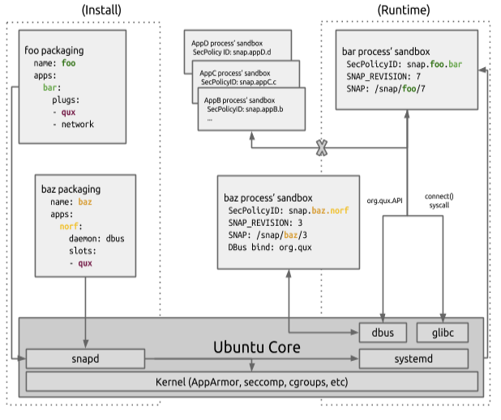

# Ubuntu Core 16 - Security

## Whitepaper

* * *
CANONICAL UBUNTU ENGINEERING AND SERVICES

Version: 2.0.0~rc2

[[TOC]]

# Abstract

Ubuntu Core is an important revolutionary step for Ubuntu. While it builds upon
Linux traditions, Snappy for Ubuntu Core sharply focuses on predictability,
reliability and security while at the same time enabling developer freedom and
control.

# Problem

The Linux distribution model is an established and well understood model for
computing systems: start with a Linux kernel, add some low-level software to
install, manage and use applications and then add some default applications with
additional applications installable by other means, usually over the internet
via a distribution software archive. Every once in awhile, update the kernel and
software layers, stabilize everything, then release a new version of the
distribution. Classic Ubuntu has done exactly this for many years and its
continued success provides an important touchstone for moving forward.

While the Linux distribution model is tried and true and extremely flexible,
using it in a modern application-centric world of interconnected devices and
systems uncovers many challenges:

* Installed software is considered trusted by the OS
* The Operating System (OS) and applications are tightly coupled and
  applications must target a specific OS release, decreasing developer velocity
* Applications can change and have side-effects on the OS and vice versa
* Broken upgrades in one part of the system can prevent upgrades of the rest of
* the system

# Description

## Background: classic Ubuntu

Before discussing the security features and design of Snappy for Ubuntu Core, it
is helpful first to explore the merits and challenges of the traditional Linux
distribution (aka, distro) model, specifically classic Ubuntu.

### Trust model: distro

One must first understand the underlying trust model when examining the security
design of any OS. In classic Ubuntu (and other mainstream Linux distributions),
software is typically distributed either:

1. as part of the installed system OS
1. via a trusted distribution archive
1. via opt-in installations or site-specific customized provisioning

Classic Ubuntu is split up into different flavors, eg Ubuntu Desktop or Ubuntu
Server. All of the different parts that make up an Ubuntu flavor are built using
Debian-formatted packages ('debs') from the Ubuntu distribution archive. The
Ubuntu archive itself is broken up into different 'components' which distinguish
the level of support (official support from Canonical vs support from the Ubuntu
community) and licensing constraints (Free Software vs freely distributable but
otherwise non-Free software). The archive is further broken up into different
'pockets' that denote the nature of the update (eg, 'security' for security
updates and 'updates' for non-security bug fixes). Archive integrity and OS
upgrades contribute to classic Ubuntu's trust model.

#### Archive integrity

Ubuntu uses a "signed archive" and all uploads to the Ubuntu archive are restricted:

* Only verifiably signed source packages are allowed in the archive (all binary
  packages in the archive are built using source packages signed and uploaded by
  Ubuntu developers)
* Signed source packages are checksummed (all of MD5, SHA1, SHA256) and added
  to Ubuntu archive Sources file
* Binaries built from signed source packages are checksummed (all of MD5, SHA1,
  SHA256) and added to the Ubuntu archive's Packages file
* Sources and Packages files are checksummed (all of MD5, SHA1, SHA256) and
  added to Ubuntu archive Releases file
* Releases file is signed by Ubuntu archive gpg key and saved as Releases.gpg
  in the Ubuntu archive

#### Upgrades

Ubuntu upgrades may happen as part of applying security and high impact bug
fixes to a stable release of Ubuntu or as part of upgrading Ubuntu from one
release to another. Ubuntu releases a new version of the OS every 6 months with
a Long Term Support (LTS) release usually every 2 years. LTS releases receive
official support for 5 years and interim releases receive official support for 9
months. There is no distinction between OS upgrades, Ubuntu archive upgrades or
3rd party software upgrades during the upgrade process.

Ubuntu developers update software in the Ubuntu archive by updating a Debian
source package (targeting a particular release), signing it with the GPG key
associated with the developer's account in Launchpad[^1], then
uploading it to Launchpad where it is verified, built, automatically tested and
published to the archive. This process is essentially the same regardless of if
the target release is for the development release or an existing stable release.
The only differences are who is allowed to upload and the upload processes
governing the target release. For example, only members of the Ubuntu Security
team may upload to the 'security pocket'.

#### Software in classic Ubuntu: trusted by the OS

All of the above informs the trust model for classic Ubuntu, specifically,
**software installed via the packaging system is considered trusted by the OS**.
As such, software installed via `apt` (Ubuntu's package manager):

* Is permitted to install its files on the system and perform administrative
  tasks as part of installation
* Can typically access any resources or data available within the user's session
* Has limited access to system services and data as defined by the OS (i.e.,
  traditional filesystem permissions, `PolicyKit`, etc)
* May receive security and high impact bug fixes depending on the software's
  support status
* May optionally run under specialized confinement after installation

#### Challenges for distro model

The classic Ubuntu distribution is a time-tested, well-understood and very
flexible model that is well-suited for many purposes, but it also has a number
of drawbacks for the modern, fast-paced, app-centric world:

* The OS and installed software are viewed holistically by the system rather
  than separately. This can complicate testing, impede reproducibility,
  introduce unpredictable interactions between software, etc.
* In order to maintain stability and reliability of the whole system, Ubuntu
  archive stable release update policies dictate that the base versions of
  software found in a particular release of the distribution (typically)
  should not change. Instead, bug and security fixes must come from isolated
  patches to the stable release version rather than new upstream software
  releases.
* Because of Ubuntu's update policies, new features may (typically) only be
  introduced with new Ubuntu releases and not as part of the stable release
  update process. This significantly decreases developer velocity since
  developers and users must wait up to 6 months before new features to the
  software can be added to the next OS release.
* All software installed using the system package management system, whether
  it comes from the trusted Ubuntu archive or not, is considered trusted by the
  OS. More concretely, installing packages gives full access to the system to
  the packager of the software.

To answer some of the challenges inherent in Ubuntu's distribution model,
classic Ubuntu employs many OS and toolchain hardening features to guard against
attacks. Users are advised to only install packages from the official Ubuntu
archive or from trusted sources.

### Staying up to date

As mentioned, classic Ubuntu uses the apt package management tool to perform
individual package updates via a signed archive. The upgrade process consists
of:

* When checking for updates, client systems download the `Releases.gpg`,
  `Releases`, `Packages` and optionally `Sources` files
* The Releases file is verified using `Releases.gpg` and the locally installed
  Ubuntu archive gpg public key
* If the Releases file verifies, the checksums for the `Packages` file are
  verified (and `Sources` if needed)
* If there are updates, the updated binaries are downloaded and their checksums
  verified against the contents of the `Packages` file (source packages are
  verified against the `Sources` file)
* After downloading all of the updated packages, the updates are installed

In order to maintain security, the system must always be kept up to date. The
update system on Ubuntu may be configured in various ways, such as to apply
updates automatically (e.g., via `unattended-upgrades` (the default for new
installs as of 16.04 LTS), but this will never automatically trigger a reboot)
or to prompt when a new version of Ubuntu is released.

While the venerable `apt` package management system has many admirable
qualities, it lacks some important features such as transactional updates and
rollbacks. For example, it is possible for a packaging bug in one package to
prevent updates to the system or other unrelated packages even when
`unattended-upgrades` is in use. When this happens, unapplying the broken
update and fixing the system is a manual process. Site-specific update
policies, APT-proxies, management tools (such as Landscape), configuration
management systems, etc are sometimes employed to mitigate these deficiencies.

### Boot security

Classic Ubuntu employs a typical boot process:

1. The firmware/BIOS powers on, does self-checks and passes control to a 1st
stage bootloader. Depending on the architecture and target system, this
bootloader may be the standard Ubuntu bootloader (GRUB) or something that boots
a second stage bootloader.
1. The bootloader (1st or 2nd stage depending on the target system) boots the
kernel
1. The kernel loads its initrd (initial ramdisk) and any required kernel modules
1. The kernel starts the init process (ie, systemd on Ubuntu 15.04 and higher)
1. The init process launches console logins, system services, application
services, etc

This traditional scheme requires that host security not allow any of the above
steps to be subverted.

Classic Ubuntu also supports enforcing UEFI Secure Boot[^2]:

1. The firmware/BIOS powers on, does self-checks and verification of firmware
modules, then verifies the bootloader. If the bootloader verifies, control is
passed to it.
1. The bootloader verifies the kernel. If the kernel verifies, the kernel is
booted with UEFI quirks enabled. Otherwise, the boot fails.
1. The kernel then verifies the modules required to boot. If a module fails to
verify, it is blocked from loading and the failed verification is logged. In
either case, the initrd is loaded.
1. The kernel starts the init process (systemd)
1. The init process launches console logins, system services, application
services, etc

In this manner, a root of trust that is set in device firmware can be used to
verify the system to the running kernel to protect against attacks on early boot
which is quite useful since the kernel enforces security policy on the system.
To accommodate freedom and developer needs, the system will support using a
fallback mode via a firmware setting.

### System, application and network security

The security of a classic Ubuntu system is a complex topic with many
contributing factors:

* Ensuring the system is kept up to date with security fixes (Canonical
provides timely updates for officially supported software)
* Ubuntu's use of many OS and toolchain hardening features[^3]. Some of these
include:
    * Kernel hardening such as 0-address protection, /dev/mem protection,
    /dev/kmem disable, read-only data sections, compiled with stack
    protector, module RO/NX, kernel address display restriction and
    blacklisting rare protocols. Opt-in features include blocking module
    loading, syscall filtering (seccomp) and blocking kexec
    * Userspace hardening such as symlink and hardlink restrictions, ptrace
    restrictions, /proc/<pid>/maps restrictions, and NX/XD support
    * Toolchain hardening by default (stack protector, heap protector, pointer
    obfuscation, ASLR (stack, libs/mmap, brk, VDSO), fortify source) with
    additional opt-in hardening (PIE[^4]/exec ASLR, RELRO, BIND_NOW)
    * AppArmor Mandatory Access Control (MAC) confinement. AppArmor can mediate:
    system files and user data, networking, library loading, execution of
    applications, Linux kernel capabilities, mount, DBus, IPC (signals, ptrace,
    unix sockets, …), and can be used to confine containers at the container
    level[^5] as well as applications within the container[^6]
* Ubuntu's implementation defaults for officially supported software. These
include:
    * Safe, usable default file permissions (including filesystem capabilities
      and limiting SUID binaries)
    * Logins disabled for well-known system accounts (eg, root, www-data, etc)
    * Open network ports in the default install are limited to network
    infrastructure services like dhcp client and avahi
    * Use of strong password hashing (SHA512crypt)
    * Usable but safe configuration defaults
    * Restrictive DBus bus policy for DBus system services and restrictive
    PolicyKit policies for interacting with privileged processes
    * Running services as non-root or privilege-separated whenever possible
    * Turning on opt-in compiler hardening options for sensitive software (eg,
    PIE for openssh, apache2, etc) or configuration hardening (eg, turn on
    seccomp sandbox in openssh, network namespace in vsftpd, etc)
    * Firewall software installed by default (ufw, iptables)
    * AppArmor profiles enabled/available for select applications[^7] (eg,
    virtual machines, LXC containers, software having a history of
    vulnerabilities or that is network facing, etc)
* Ensuring deb-based software is only installed from trusted sources
* Starting with Ubuntu 16.04, all flavors may install snaps from the Ubuntu
Store. On a traditional system, signature verification is performed on snaps
installed from the Ubuntu Store and these snaps are run within a restrictive
sandbox.
    * **IMPORTANT**: the classic Ubuntu Desktop system uses the X window system
    and Unity 7 shell environment which do not provide isolation of graphical
    applications running within the a specific user's graphical session (eg,
    mediation for keyboard, mouse, screen grabs, clipboard, Xsettings, etc.,
    is not supported). Snaps for graphical applications using X and Unity 7
    should only be installed from trusted developers[^8]. Future releases of
    Ubuntu Desktop will use the secure Mir display server with Unity 8 which
    are both designed to properly isolate graphical applications.
* Proper user and password management. As part of the installation process, a
user account is setup and it is automatically added to the 'sudo' group and is
thus capable of running commands as root with password prompting.
* Appropriate non-default configuration by someone knowledgeable
* Ensuring 3rd party software is free from defects

Because the classic Ubuntu system is infinitely flexible and has tremendous
utility (nearly anything can be built using it), there are a number of
challenges to the overall security stance of a deployed system. The Ubuntu
archive is a rich ecosystem with thousands of packages and the secure
configuration and interaction between different software components relies on a
combination of the upstream developer's intent, Ubuntu packaging and the
user/administrator's use. For example, consider a system that is setup to
provide a webserver to serve various web pages. The administrator installs
Apache using 'apt-get'. While Apache in Ubuntu is compiled with PIE and supplies
a reasonable default configuration, the administrator could accidentally
configure the Apache web server to run as root and serve all of the system's
files, exposing sensitive information. After the configuration problem is fixed,
the administrator could install a poorly written 3rd party PHP script which can
be made to execute any programs on the system under the `www-data` user. After
that vulnerability is addressed, a separate vulnerability in an installed
content management system (CMS) could then allow a similar attack. To guard
against attacks and exposing sensitive information, an administrator might
employ processes surrounding configuration management and/or write a
site-specific AppArmor profile for Apache to help mitigate against flaws or
misconfiguration of the system.

Complex interactions can also impact security, such as the intended PolicyKit
permissions of NetworkManager being obviated by a separate installed DBus system
service that didn't implement its API correctly and can be subverted into
proxying requests to NetworkManager without authentication. To thwart this,
site-policies might dictate restrictions on installed software or the
administrator might write a site-specific AppArmor profile, adjust the DBus bus
policy and/or adjust PolicyKit configuration for the various services.

It is also possible that updating one part of the system could have a
side-effect on another part of the system which could cause a component to crash
or fail open. For example, perhaps an API call changed its internal default or a
plugin required for implementing a security check is no longer installed by
default after performing an OS upgrade.

While classic Ubuntu is implemented to be secure by default and infinitely
extendable and configurable, these examples illustrate some of the
considerations when maintaining a strong security stance on a traditional Linux
distribution like Ubuntu.

### Logging

Classic Ubuntu systems use `systemd` as the `init` process by default and
therefore all system logging information can be accessed via the `journalctl`
command. In addition, systemd is configured to forward all logging information
to the `rsyslog` logging service. The system uses a simplified logging scheme
(which can be modified for site requirements) that consists of:

* **/var/log/auth.log**: all authentication logs (`auth.*` and `authpriv.*`)
* **/var/log/syslog**: everything except authentication logs (`auth.*` and
  `authpriv.*`). AppArmor and seccomp denials are logged here.
* **/var/log/kern.log**: all kernel logs (`kern.*`)
* **/var/log/mail.log**: all mail logs (`mail.*`)
* **/var/log/audit/audit.log**: all kernel audit subsystem (including kernel
  LSM denials) when 'auditd' is installed[^9]

`rsyslog` by default is not configured for remote logging (sending or receiving)
and is configured to log some of the above into additional log files in
`/var/log`. Applications may log to their own log files and the `dmesg` command is
also supported. Ubuntu 16.04 Desktop uses `upstart` as the session bus and it
will log session services to files in `$HOME/.cache/upstart`.

### Clock synchronization

Ubuntu 16.04 uses 'systemd-timesyncd' for time synchronization with remote NTP
servers and it is enabled by default. 'ntp' and 'ntpdate' are also available and
officially supported by Canonical.

### Data encryption

Classic Ubuntu offers full disk encryption (`dm-crypt` of everything except the
`/boot` partition) and encrypted HOME (eCryptfs; encrypting each user's data
with different encryption keys wrapped with the user's passphrase) as part of
the installation process.

### Trusted Platform Module

TPM is a standards-based embedded security subsystem typically implemented as a
hardware chip on the mainboard. Classic Ubuntu has TPM 1.2 and 2.0 support
enabled in the kernel (`CONFIG_TCG_TPM` and `CONFIG_HW_RANDOM_TPM`). TPM 1.2
userspace is provided by tpm-tools and TrouSerS and the TPM 2.0 userspace
components consist of tpm2-tools and libtss2-0. TPM is not currently integrated
into Ubuntu beyond the inclusion of these tools.

## Snappy for Ubuntu Core

Ubuntu Core is in many ways simply another flavor of Ubuntu (eg, the root
filesystem is built from packages from the same Ubuntu archive as other
flavors), but it differs in many important ways:

* The base system is a very minimal system that consists of three different
parts: the kernel, gadget and OS which are all packaged and delivered using
the new snap packaging format
* There is a clean separation between the base system and the applications
installed on the system as well as a clean separation between installed
applications
* Ubuntu Core replaces `apt` with the new `snap` command and applications are
packaged and delivered as 'snaps'
* The root filesystem is read-only
* Developers may update applications independently of the OS
* Applications run in a security sandbox by default
* Ubuntu Core is application-centric instead of distribution archive-centric

The above qualities aim to address many of the challenges inherent in the
traditional Linux distribution model and greatly increase reliability,
predictability and security.

### Trust model: snaps and the store

The trust model of Snappy for Ubuntu Core is different from classic Ubuntu and
this is due in part to how software is distributed. Software is either:

1. Part of the OS snap (constructed from debs from the Ubuntu archive)
1. Pre-installed via the gadget snap (snaps installed during provisioning)
1. Installed via the store as application snaps

Software on an Ubuntu Core system can then be categorized as:

* **Untrusted by the OS**
  To facilitate developer velocity and allow users to access the latest versions
  of applications without updating their OS, snaps are distributed via the
  Ubuntu Store. Ubuntu Store snaps are considered untrusted (more on this
  later) and run in a restricted sandbox. This allows store reviews of snaps to
  be shallow and automated. Untrusted applications:
    * can freely access their own data
    * cannot access other applications' data
    * cannot access non-application-specific user data
    * cannot access privileged portions of the OS
    * cannot access privileged system APIs
    * may access sensitive APIs with user permission provided the API asks for
    permission at time of access or the permission is granted to the application
    outside of snap installation
* **Trusted by the OS**
  Software installed as part of the OS snap is considered trusted by the OS
  because it is built from the Ubuntu archive[^10], therefore all the
  previously discussed archive integrity checks for classic Ubuntu apply for
  the software shipped in the OS snap. This software may or may not run under
  confinement. Applications trusted by the OS:
    * can typically access any resources or data available within the user's
    session
    * have limited access to system services and data as permitted by the
    OS (ie, traditional file system permissions, Linux kernel capabilities,
    DBus bus policy, etc all apply)

Some snaps may implement interfaces (discussed in detail below) to mediate
access to shared resources and will have the necessary privileged access to the
system to function. Store policies and security policies work together to ensure
the system is secure.

#### Store policies

When the author of an application releases a new version, the snap package is
uploaded to the Ubuntu Store and the snap undergoes automatic reviews. Part of
this review process involves examining the snap's requested interfaces (security
policy).

If a snap passes the review, it can be made immediately available to users and
devices. If it does not pass review, it is blocked and the uploader may request
a manual review. The store's upload policies and the security policies
associated with an individual snap's declared interfaces work together to ensure
that users and devices are protected from malformed or malicious snaps.

The official public Ubuntu Store is intended for anyone to use and it therefore
has very strict upload policies. Kernel and gadget snaps require manual review
and snaps implementing sensitive Ubuntu Core interfaces are pre-approved (e.g.,
through negotiation with Canonical).

Brand stores (hosted via the Ubuntu Store) are essentially owned by a particular
brand and may optionally specify different upload policies as the brand sees
fit. For example, it is possible to restrict uploads to certain employees in the
brand's company. As such, this company might change their store upload policies
to allow app snaps implementing a sensitive security interface to pass provided
they come from the owner of the store. Access to brand stores can be configured
to be limited to certain devices.

### Staying up to date

Because the base system and installed applications are treated separately, their
update processes differ.

#### System update process

In general, the base system is delivered via three snaps that work together:
* OS: provided by Canonical
* Kernel: provided by either Canonical[^11] or the vendor of a particular device
* Gadget: provided by either Canonical or the vendor of a particular device

The kernel snap provides the kernel and drivers, the OS snap provides the rest
of operating system and the gadget snap provides boot, kernel, OS and
application configuration. Each of these snaps may be updated independently of
one another.

For Canonical-provided OS and kernel snaps, the update process relies upon the
classic Ubuntu archive distribution model and the system update process is
essentially the same regardless of if these snaps are for the development
release or an existing stable release. The only differences are who is allowed
to upload and the upload processes governing the target release.

The OS and kernel snap update process has an additional step over classic
Ubuntu: the channel[^12]. When an Ubuntu Core system is provisioned, it
is targeted at a particular Ubuntu release (eg, '16'[^13]) and a particular
channel (eg, 'stable'). Updates will flow from the Ubuntu archive to the Ubuntu
store into the 'edge' channel for a given Ubuntu release automatically. Updates
to the 'stable' channel may pull from other channels (eg, 'edge') and undergo
additional QA and the stable channel is updated on a predictable cadence. High
impact security updates or critical bug fixes may be pushed to the stable
channel outside of this process and cadence as necessary.

For gadget and vendor kernel snaps, the origin of the snap is the
developer/vendor of the snap instead of the Ubuntu archive and updates to these
snaps are done via direct upload to the Ubuntu (or brand) store. The store
limits who can upload what via store accounts.

Ubuntu Core 16 systems retains previous versions of snaps to support rollbacks
and improve reliability[^14]. For example, if on reboot after updating the
kernel or OS snap the system fails to come up, it is rebooted to use the
previous known-good kernel or OS snap.

Ubuntu developers wanting to update the OS or reference kernel snap will:

* Update a Debian source package (targeting a particular classic Ubuntu
  release), sign it with the GPG key associated with the developer's account in
  Launchpad, then upload to Launchpad where it is verified, built,
  automatically tested and published to the archive

The Canonical image server will, per Ubuntu release and channel:
* Via `apt`, notice that packages in the Ubuntu archive are newer than what is
on the current image for this release/channel
* Via `apt` upgrade the OS and kernel snaps using the same methodologies
described for classic Ubuntu, above
* Calculate image deltas[^15] between the new snap and previous snaps
* Publish the snap (and its associated deltas) as per the channel policies

Ubuntu Core systems will:

* Via https, notice that an update is available
* Via https, calculate whether to use snap deltas or the full snap[^16]
* Via https, download the updated snap or snap deltas
* Verify the signature of the snap/applied snap deltas with the server's
public key
* Update the boot configuration to use the new OS and/or kernel snap

Ubuntu Core systems are configured by default to automatically install updates
and reboot[^17] to improve security. The `snap refresh <snap name>` command
may also be used at any time to trigger an update, prompting to reboot.

#### App, gadget and vendor kernel update process

The update process for application, gadget and vendor kernel snaps is different
than the system update process because developers upload to the store rather
than to the Ubuntu archive. The developer will:

* Develop the snap (and for app snaps, bundling any necessary libraries, data
  and programs to properly run)
* Create an account on Launchpad (if not done already)
* Create a project for this snap (one time only) in the Ubuntu store tied to
the Launchpad account
* Upload the snap to the store under the appropriate Launchpad account and
store project via https, targeting particular Ubuntu releases, a channel and
whether or not to automatically publish

The store will then:

* Perform automated checks on the uploaded snap. If errors are found, they are
reported to the uploader and the snap is not published
* If the snap passes automated checks, the store GPG-signs the snap with a
store signing key and publishes the snap to the store either automatically or
when the uploader triggers it at a later time

Ubuntu Core systems will:

* As part of the factory install process[^18], a unique identifier for the
device (eg, a serial number) will be signed by the vendor. The vendor's public
key will be given to Canonical and optionally associated with a Brand store for
the vendor
* On first launch, the device will register with the store by presenting the
signed unique identifier to the store and optionally which Brand store to
access. The store will verify the signature and if specified, register the
device to the Brand store. A device may only be registered with one store
* Query the public Ubuntu store or a Brand store via https for any updates
* If updates are available, download the updated snaps via https
* Verify the signature of the snap with the store's public key
* If verification succeeds, install the snap

Like with system updates, Ubuntu Core systems are configured by default to
automatically install updates. The `snap refresh <snap name>` command may also
be used at any time to trigger an update. Package rollbacks and binary deltas
for app, gadget and vendor kernel snaps will be supported in the future.

### Boot security

Ubuntu Core 16 has the same boot process as classic Ubuntu and supports both
traditional boot and enforcing UEFI Secure Boot for amd64 (see above). Unlike
classic Ubuntu, snaps on Ubuntu Core run under an application sandbox and
malicious applications or subverted processes are not allowed to modify the
firmware, bootloader, kernel, modules, initrd, and init and they are not allowed
to interact with the base system except in very controlled ways.

### System security

#### System services

The Ubuntu Core base system (ie, the kernel and OS snap) contains little more
than a kernel, the init process, snapd itself, standard Linux/UNIX tools,
libraries to support these tools and a few standard tools to make application
development easier. Therefore, it offers a reduced attack surface:

* Kernel syscall interface, modules as well as `/proc` and `/sys` entries
* One listening network service: dhclient (DHCP client). The dhclient program
runs under a restrictive AppArmor profile by default.
* OpenSSH can optionally be enabled during provisioning and when enabled it is
configured with `PermitRootLogin prohibit-password` to disable root logins
when a password is set. `/etc/ssh/sshd_config` is writable, so it can be
updated for site-specific needs.
* A few other non-network-facing services exist to support normal system
operation: `init` (`systemd`), `systemd-journald`, `systemd-udevd`,
`systemd-timesyncd`, `systemd-logind`, `crond`, `rsyslogd`, `cgmanager`,
`dbus-daemon`, `agetty` and `snapd`[^19].
* Because the base system is built from the Ubuntu archive, it benefits from
all of the OS and toolchain hardening features of classic Ubuntu.

App snaps by default are disallowed access to all system services and have
limited access to kernel interfaces. Ubuntu Core also provides restricted
interfaces that the gadget developer or device administrator may assign
(connect) to trusted snaps.

#### Users

The administrative user (ie, `root`) has a disabled password. All system users
have disabled logins.

One user account is setup by default (user: `ubuntu`, password: `ubuntu`) and
it is in the `sudo` group and is thus capable of running commands as root (by
default without password prompting but configurable via
`/etc/sudoers.d/90-cloud-init-users`). The account can be locked via standard
means (ie, `passwd --lock`). It is highly recommended that an alternate password
be set or the account locked on production systems. It will be possible to
disable this user during provisioning.

Multiuser support is limited on Ubuntu Core 16, but alternate user accounts can
be set up using standard tools (eg, `addgroup`, `adduser`, etc).

Per-snap users are not supported in Ubuntu Core 16. This will be implemented at
a future date.

#### App services and user commands

The Ubuntu Core system is designed to segregate the system from applications,
and to segregate applications from each other, while providing controlled
mechanisms for interacting with each other. For example, snaps are not allowed
to use crond, change to another user, have unapproved access to hardware, add
rsyslog rules, add users, ship `setuid`/`setgid` programs, change security
policy, modify the system, modify kernel runtime variables, access sensitive
kernel syscalls, etc.

Snaps may provide commands that may or may not run in the background. Commands
that the user may run via console logins are installed in `/snap/bin`, which is
included in the console user's PATH. Services are commands that run in the
background and are long running processes that integrate with the systemd boot
process to start automatically on boot. While the systemd unit specification is
very rich, Ubuntu Core only exposes a very small subset of the specification in
the snap packaging: `start-command`, `stop-command`, `post-stop-command`,
`stop-timeout`, daemon type, `socket`, and `listen-stream`. On system install,
the systemd unit file is autogenerated based on these packaging options. This
prevents snaps from interacting with systemd and the system in uncontrolled
ways.

Certain Ubuntu Core interfaces provide DBus bus policy and security policy
allowing running as a DBus service. While the DBus bus policy specification is
also rich, the OS snap itself provides the bus policy instead of the snaps
implementing the interface.

Importantly, to prevent unexpected interactions and maintain co-installability,
whenever the system and snaps could potentially collide, the system will use
naming conventions to avoid a collision. For example, snaps are installed to an
snap-specific path, DBus connection names and interfaces are provided by the OS
snap, socket activation and connections must follow snap-specific naming
schemes, etc (discussed in detail, below).

### Application security

Application security is achieved through the combination of security and store
policies working together.

**Application developers** typically do not have to understand the low level
implementation details on how security policy is enforced. Instead, security
policy is declared through an easy-to-use interfaces system. Ubuntu Core also
provides a per-snap developer mode to ease application development and working
with the sandbox.

**Gadget developers** typically do not have to understand the low level
implementation details of confinement, but they may want to preconfigure snaps'
interface connections to work with the gadget's hardware.

In order to better understand how confinement works, it is helpful to be
familiar with several concepts:

* App snaps
* Gadget snaps
* Security policy ID
* Application launching
* Snappy FHS (Filesystem Hierarchy Standard)
* Security trust model (previously discussed)
* Store policies (previously discussed)

#### App snaps

App snaps are the primary method for making a Snappy system useful. App snaps
are used to ship services that should start on boot or commands that the user or
admin can run. All app snaps run under confinement in a restrictive security
sandbox that is configured in the snap packaging.

Because the Ubuntu Core base system is minimal, snaps bundle everything they
need in the snap which allows developers to carefully control the application's
runtime environment. This technique adds predictability and reliability to the
development process, but means that developers are responsible for security
issues found in the bundled parts. The snapcraft tool can help because it allows
developers to bundle debs from the Ubuntu archive in snaps and makes it easy to
rebuild those snaps with updated debs that have received a security fix.

#### Gadget snaps

Gadget snaps may be used to declare hardware capabilities to the system and
pre-assign access to snaps that need to use this hardware.

#### Security policy ID

Applications are tracked by the system using the concept of a security policy ID
and this ID is the composition of elements from the snap's packaging.
Specifically, it consists of the package name and the command name. The security
policy ID takes the form of **snap.<name>.<command>**.

For example, if this is in the snap packaging:
```yaml
name: **foo**
...
apps:
  **bar:**

    command: bin/bar
```
then the security policy ID for the `bar` command is '**snap.foo.bar**'. The
security policy ID is used throughout the system including in the enforcement
of security policy by the application launcher.

#### Application launch

Whether the snap contains services or user commands in its snap packaging,
launching of these executables happens via the launcher (`ubuntu-core-launcher`)
and the security policy and launcher enforce application isolation. When an
application is started, the launcher will:

* Set up various environment variables (see below. Note, for background
  services it is the systemd service definition that sets these variables and
  starts the launcher)
* Change directory to a writable data directory (see below. Note, for
  background services it is the systemd service definition that specifies the
  working directory)
* If hardware access is assigned to the snap, set up a device control group
with default devices (eg, `/dev/null`, `/dev/urandom`, etc) and any devices
which are assigned to this snap (more on this later)
* Set up the seccomp filter. Seccomp is a Linux kernel syscall filter (see
below). All child processes inherit the parent's filter.
* Set up a devpts new instance for the command (see below)
* Set up a private `/tmp` for the command
* Set a default nice value
* Execute the command under an AppArmor profile. AppArmor is a Linux Security
Module (LSM) that implements Mandatory Access Controls (MAC, see below). Child
processes inherit the parent's policy unless the policy defines a profile
transition.

Importantly, the snap's security policy does not allow modification of the
security sandbox in which it runs (this is reserved for the launcher, which
snaps do not control). Because the launcher needs privileges to set up the
sandbox, the launcher itself is confined with a restrictive AppArmor profile.

This combination of technologies and restrictive security policies provide for
strong application confinement and isolation.

#### Snappy FHS (filesystem hierarchy standard)

Each Ubuntu Core system adheres to the Snappy filesystem layout so that snaps
are separate from the system and each other. In terms of application confinement
this simply means there are areas of the filesystem that are designated as
**read-only** and areas that are designated as **writable** by the snap. On
application start several environment variables are set to help applications
determine their readable and writable areas, origin, version, etc. These
variables are:

* **SNAP**: installation directory (**read-only)**
* **SNAP_ARCH**: architecture of the system (eg, amd64, arm64, armhf, i386, etc)
* **SNAP_DATA**: application data directory (**writable**)
* **SNAP_LIBRARY_PATH**: library paths added to LD_LIBRARY_PATH
* **SNAP_NAME**: package name
* **SNAP_REVISION**: store revision for this snap
* **SNAP_USER_DATA**: per-user application data directory (**writable**)
* **SNAP_VERSION**: package version
* **TMPDIR**: temporary directory (**writable**)
* **HOME**: set to `SNAP_DATA` for services and `SNAP_USER_DATA` for user
commands. The working directory for commands is changed to this on launch

#### Snappy security technologies overview

Several technologies are used by Ubuntu Core to implement the security sandbox.
The security sandbox is designed so that snaps are integrated into the OS and
can interact with one another in controlled ways.

##### Traditional permissions

The Linux kernel enforces Discretionary Access Controls (DAC) via traditional
UNIX `owner` permissions as well as Linux kernel capabilities and the Ubuntu
Core base system uses these permissions extensively. For app snaps on Ubuntu
Core 16, services run as root and therefore traditional permissions alone do not
play as important of a role in the confinement of services. Future versions of
Ubuntu Core will allow snaps to optionally request snap-specific, non-root users
and groups for services.

##### AppArmor

AppArmor is a Mandatory Access Control (MAC) system which ensures kernel level
enforcement of programs and processes to a limited set of resources. AppArmor
restricts processes running either as root or non-root and confinement policy is
provided via profiles loaded into the kernel. AppArmor in Ubuntu Core 16
mediates:

* File access and library loading
* Execution of applications
* Coarse-grained networking
* Linux kernel capabilities
* Coarse owner checks (euid/fsuid matching)
* Mount
* UNIX named, abstract and anonymous sockets
* DBus communications
* UNIX signals
* Process tracing (ptrace)

An important concept to understand is when a process is started an AppArmor
label is attached to it. This label is used to map the process to its policy and
is consulted in process interactions and file accesses. The label for a snap's
process is the same as its security policy ID (this is performed by the
launcher). In this manner, all commands from a snap are given a unique label and
all mediation is performed against the AppArmor policy associated with that
label. When a process executes another binary, an execution transition is
performed (if the policy allows it). AppArmor supports several different
execution transitions, but the most important one to remember for typical
application confinement in Ubuntu Core is that the child process will inherit
the parent's label (and therefore policy).

##### Seccomp

When userspace programs need to interact with the hardware (eg, to open a file
or to connect to a machine over the network) or other kernel functionality, they
do so via the syscall interface to the Linux kernel. The kernel has a few
hundred syscalls for a given architecture and a process may set up a syscall
filter using the seccomp facility in the Linux kernel to limit the syscalls the
process may use. Child processes inherit the parent's seccomp filter and while
they can make the filter more strict, they may not make it less strict. The
launcher will set a seccomp filter for the command before executing it.

##### Namespaces

Namespaces are a facility provided by the Linux kernel that allows separating
processes in such a manner that they cannot see or access resources from another
namespace. Several namespaces exist, such as file, network, and mount
namespaces. Namespaces play a vital role in container technologies such as
LXC/LXD and Docker, but their use is not limited to these full-blown container
implementations. Ubuntu Core uses a mount namespace to implement a per-snap
`/tmp` directory.

In general, snaps' processes run in the global (ie, default) namespace to
facilitate communications and sharing between snaps and because this is more
familiar for developers and administrators. For those desiring full containers,
LXD and Docker[^20] snaps are available for installation from the store.

##### Control Groups (cgroups)

Cgroups are a way to group processes for resource limiting, prioritizing,
accounting, etc. Several cgroups exist, such as devices, memory, cpuacct,
cpuset, net_cls and net_prio and cgroups are widely used in conjunction with
container technologies. Ubuntu Core currently uses the devices cgroup for
hardware device access controls for hardware assignment.

##### devpts newinstance

The Linux kernel provides pseudoterminal (PTYs) functionality for login sessions
and TTY capabilities and supports System V/Unix98 naming schemes via the
`/dev/ptmx` master PTY device file with slave PTYs in the `/dev/pts` filesystem.
Ubuntu Core configures the devpts filesystem in multi-instance mode and mounts a
new devpts instance per command to prevent snooping and input injection via
`/dev/pts`.

##### Ubuntu hardening

Ubuntu hardening plays an important role in application security:

* YAMA LSM is enabled in Canonical-supported kernels and provides ptrace
scoping, symlink restrictions and hardlink restrictions
* Canonical-supplied kernels have the kernel hardening benefits of classic
Ubuntu kernels
* Applications using the Ubuntu Core base system libraries and interpreters as
well as applications built with the Ubuntu toolchain and/or bundling debs from
the Ubuntu archive (eg, using snapcraft) benefit from the same toolchain and
glibc hardening protections available to classic Ubuntu and the Ubuntu Core
base system

#### Snap security policy

Security profiles for snaps use a default security profile provided by the OS
snap and are extended via Ubuntu Core interfaces. A snap's packaging may declare
requested interfaces to consume via plugs and requested interfaces to provide
via slots (if unspecified, the default policy is used with no additional
interfaces). Upon snap install, snap-specific security policy is autogenerated
with any auto-connectable interface security policy. Interfaces that provide
privileged access to the system are not auto-connected by default and the
administrator of the system must manually connect these via the `snap connect`
command (the gadget developer may auto-connect preinstalled snaps).

When a snap is uploaded to the store, part of the review process involves
examining the snap's declared interfaces to determine if the snap meets the
store's upload policies. Certain interface declarations will trigger a manual
review in the public Ubuntu Store, but Brand stores may be configured to not
always require a manual review.

When this section refers to 'snap packaging' for defining security policy for
snaps, it applies to both `meta/snap.yaml` and `snapcraft.yaml`[^21].

##### Default policy

The default security policy defines the bulk of the security policy. The default
policy on Ubuntu Core 16 enforces adherence to the Snappy FHS with enough access
to the base system for the program to run. Specifically:

* read-only access to SNAP, which is set to the versioned install path
* write access to `SNAP_DATA` and `SNAP_USER_DATA`, which are both set to a
versioned path in `/var` and `/home`, respectively
* read-only access to install path and data directories of previous versions
* access to system libraries and a subset of executables in `/bin`,
`/sbin`, `/usr/bin` and `/usr/sbin`
* write access to shared memory files (ie, `/dev/shm/snap.SNAP_NAME.*`)
* allow processes from the same snap to communicate with each other via
abstract and anonymous sockets
* allow processes from the same snap to signal each other via signals
* various common accesses that are deemed safe

All commands within a snap share the same readable and writable areas.

##### Interfaces

Ubuntu Core implements many interfaces for snaps to request and use. The list of
interfaces will grow throughout the lifetime of Ubuntu Core 16[^22] and at any
given time the list of available interfaces on a particular device (and the
connection status) can be seen with 'snap interfaces'. An important concept with
interfaces is the connection: the OS snap or a snap service command implements a
slot interface and a client may plug into (use) the slot when an Ubuntu Core
interface connection is made. Interfaces form a contract between the slot
provider and the plug consumer such that any snaps using a given interface will
be able to interoperate with each other.

###### Ubuntu Core interfaces

The release of Ubuntu Core 16 ships the following interfaces:

* **firewall-control**: Can configure the firewall via `netfilter` and `sysctl`
and grants the `CAP_NET_ADMIN` capability. Because this interface grants
privileged access, this interface is not auto-connected on install and store
policies may trigger a manual review for uploads of snaps specifying this
interface.
* **home:** Can access non-hidden files in user's `$HOME`. Because this
interface grants privileged access, this interface is not auto-connected on
install and store policies may trigger a manual review.
* **locale-control**: Can manage locales directly separate from `config
ubuntu-core`. Because this interface grants privileged access, this interface
is not auto-connected on install and store policies may trigger a manual review
for uploads of snaps specifying this interface.
* **log-observe**: Can read system logs in `/var/log` and adjust kernel `printk`
rate limiting. Because this interface grants privileged access, this interface
is not auto-connected on install and store policies may trigger a manual
review for uploads of snaps specifying this interface.
* **mount-observe**: Can query system mount information via `/proc/mounts`.
Because this interface grants privileged access, this interface is not
auto-connected on install and store policies may trigger a manual review for
uploads of snaps specifying this interface.
* **network**: Can access the network as a client
* **network-bind**: Can access the network as a server
* **network-control**: Can configure networking via `sysctl`, administrative
commands (eg, `ifconfig`, `route`, `ip`, `arp`, etc) and grants the
`CAP_NET_ADMIN` capability. Because this interface grants privileged access,
this interface is not auto-connected on install and store policies may
trigger a manual review.
* **network-observe**: Can query network status information via `sysctl`,
administrative commands (eg, `route`, `netstat`, etc). Because this interface
grants privileged access, this interface is not auto-connected on install and
store policies may trigger a manual review for uploads of snaps specifying this
interface.
* **snapd-control**: Can communicate with snapd over a UNIX socket to issue
commands equivalent to those available through the snap command line tool.
Because this interface grants privileged access, this interface is not
auto-connected on install and store policies may trigger a manual review for
uploads of snaps specifying this interface.
* **system-observe**: Can query system status information via `/proc` and the
`ps` command. Because this interface grants privileged access, this interface
is not auto-connected on install and store policies may trigger a manual
review for uploads of snaps specifying this interface.
* **timeserver-control**: Can manage time servers directly separate from
`config ubuntu-core`. Because this interface grants privileged access, this
interface is not auto-connected on install and store policies may trigger a
manual review for uploads of snaps specifying this interface.
* **timezone-control**: Can manage time zones directly separate from
`config ubuntu-core`. Because this interface grants privileged access, this
interface is not auto-connected on install and store policies may trigger a
manual review for uploads of snaps specifying this interface.

###### Ubuntu Classic interfaces

Starting with Ubuntu 16.04, all flavors may install snaps from the Ubuntu Store.
This includes classic Ubuntu Desktop systems which use the X window system and
Unity 7 shell environment and interfaces are provided for various traditional
desktop accesses. Several of these interfaces do not provide full isolation of
graphical applications running within a specific user's graphical session and
snaps using these interfaces should only be installed from trusted developers.
Future releases of Ubuntu Desktop will use the secure Mir display server with
Unity 8 which are both designed to properly isolate graphical applications.

The following interfaces are available only on Ubuntu Classic 16.04 systems (ie,
not on Ubuntu Core 16):

* **gsettings (planned)**[^23]: Can use the user session's global `gsettings`
database. This interface grants privileged access to the user's settings and
the interface is not auto-connected on install. Store policies may trigger a
manual review for uploads of snaps specifying this interface.
* **opengl**: Can use OpenGL hardware and libraries. This interface is
auto-connected.
* **unity7**: Can use X, Unity 7 DBus APIs and resources required to run
under Unity 7 as a client. This interface grants privileged access to the
user's session via the shared X server and Unity 7 DBus APIs. This interface
is auto-connected.
* **x11**: Can use X as a client. This interface grants privileged access to
the user's session via the shared X server. This interface is auto-connected.

###### Snap interfaces

In addition to these Core and Classic system interfaces, other interfaces exist
on Ubuntu Core 16 to facilitate snaps connecting to each other. For example, a
snap providing a DBus service would declare it provides a slot interface for
other snaps to use via their plugs declaration. The OS snap ships the interfaces
and associated security policies for both the slot side (server) and the plug
side (client), and the server snap implements the service within the added slot
side security policy. The following additional interfaces are available when a
snap implementing the interface is installed (some are planned for Ubuntu Core
16 with more coming as needed)[^24]:

* **bluez**: Slot policy allows access for the bluez bluetooth service and
provides DBus bus policy. Plug policy allows access to the services
implementing the corresponding slot. Both sides require privileged access and
the plugs side is not auto-connected on install. Store policies may trigger a
manual review for uploads of snaps specifying this interface.
* **mir (planned)**: Slot policy allows access for the Mir display server.
Plug policy allows access to the services implementing the corresponding slot.
Slot side provides privileged access and store policies may trigger a manual
review for uploads of snaps specifying this slot interface. The plug side will
be auto-connected.
* **network-manager**: Slot policy allows access for the NetworkManager service
to configure networking on the device and provides DBus bus policy. Plug policy
allows access to the services implementing the corresponding slot. Both sides
require privileged access and the plugs side is not auto-connected on install.
Store policies may trigger a manual review for uploads of snaps specifying this
interface.
* **pulseaudio (planned)**: Slot policy allows access for the pulseaudio
service to playback (NOTE:  Recording audio will be supported in future
version of Ubuntu Core 16) audio. Plug policy allows access to the services
implementing the corresponding slot. Slot side provides privileged access and
store policies may trigger a manual review for uploads of snaps specifying this
slot interface. The plug side will be auto-connected.
* **docker (planned)**: Slot policy allows access for docker to manage
containers. Plug policy allows access to the service implementing the
corresponding slot via the docker admin socket. Both sides require privileged
access and the plugs side is not auto-connected on install. Store policies may
trigger a manual review for uploads of snaps specifying this interface.
* **lxd (planned)**: Slot policy allows access for LXD to manage containers.
Plug policy allows access to the service implementing the corresponding slot
via the LXD admin socket. Both sides require privileged access and the plugs
side is not auto-connected on install. Store policies may trigger a manual
review for uploads of snaps specifying this interface.
* **location-observe**: Slot policy allows access for the location service to
use the GPS. Plug policy allows access to the services implementing the slot.
Both sides require privileged access and the plugs side is not auto-connected
on install. Store policies may trigger a manual review for uploads of snaps
specifying this interface.
* **location-control (planned)**: Slot policy allows accesses for controlling
the location service. Plug policy allows access to the services implementing
the slot. Both sides require privileged access and the plugs side is not
auto-connected on install. Store policies may trigger a manual review for
uploads of snaps specifying this interface.

##### Interfaces in practice

To illustrate the concept of slots and plugs, consider a bluez5 snap that
implements the bluez slot via its bluetoothd command:

```yaml
name: bluez5
...

apps:
  bluetoothd:
    command: bin/...
    slots: [bluez]
    plugs: [network]
```

When the `bluez5` snap is installed, the security policy ID for bluetoothd will
be `snap.bluez5.bluetoothd` and it will have the default security policy plus
`network` policy (since it is auto-connected) and the slot security policy
needed for `bluetoothd` to run. A snap that wants to connect to bluetoothd from
bluez5 would use:

```yaml
name: bluez-client
...

apps:
  cmd:
    command: bin/...
    plugs: [bluez]
```

When the `bluez-client` snap is installed, the security policy ID for `cmd`
will be `snap.bluez-client.cmd` and it will get the default policy only (since
the bluez interface is not auto-connected upon install). Using the `snap
connect` command (e.g. `snap connect bluez-client:bluez bluez5:bluez`) the
administrator would connect 'cmd' to 'bluez5.bluetoothd' and security policy
would be regenerated to allow `cmd` to communicate with `bluez5.bluetoothd`.

Interfaces may either be either declared per-command or per-snap. If declared
per-snap (i.e. plugs and/or slots are declared in the top-level packaging yaml),
all the commands within the snap have the interface security policy added to the
command's security policy when the interface is connected. If declared
per-command (i.e. plugs and/or slots are declared in the command's section of
the packaging yaml, as in the above examples), only the commands within the snap
that declare use of the interface have the interface security policy added to
them. As a result, the `snap connect` and `snap disconnect` commands need only
the snap name and not the command name.

The gadget snap may configure auto-connections for the device to avoid the `snap
connect` command for pre-approved interface connections. Future versions of
Ubuntu Core 16 will provide improved tooling for working with interface
connections.

#### Snap packaging example

To understand how the snap packaging, security policy and runtime all work
together, it is helpful to look at a full example. Consider the following is
uploaded to the store and the snap is assigned revision 7 by the store:

```yaml
name: foo
version: 1.0
description: foo does stuff

apps:
  bar:
    command: bin/bar-service
    daemon: simple
    plugs:
    - qux
    - network
  ctl:
    command: bin/control
```

then the:
* Security policy ID for `bar` is snap.foo.bar. It has the default security
policy with the `network` interface auto-connected.
* Security policy ID for `ctl` is snap.foo.ctl. It has the default security
policy only.

For both of the above commands, the runtime environment variables are set to
`SNAP_REVISION=7`, `SNAP=/snap/foo/7`, `SNAP_DATA=/var/snap/foo/7`, and
`SNAP_USER_DATA=$HOME/snap/foo/7`. Note that the store revision is used in the
snap-specific directories instead of the version number declared in the snap
packaging. How snap packaging, interfaces and the runtime sandbox work together
can be seen in the following diagram:



The 'foo' snap plugs into the 'qux' interface and 'baz's 'norf' service
implements the 'qux' slot. After connecting the snaps with 'snap connect foo:qux
baz:qux', the security policies are configured to allow (by seccomp filter)
'bar' to connect() to 'norf's DBus service at org.qux (by AppArmor policy).

#### Access to hardware devices

By default, snaps have very limited access to hardware devices, since
unrestricted access to hardware could result in subverting security policy – for
instance, a command with write access to the hard disk could alter security
policy or a command with read access to `/dev/input/*` could log keystrokes.
Ubuntu Core 16 will provide interfaces for assigning hardware to snaps that,
like other interfaces, can either be manually connected or auto-connected via
gadget snap assignment.

When working with hardware assignments, it is helpful to understand the
relationship between udev and the interface connection. When hardware is
assigned to a snap, a udev rule is added to
`/etc/udev/rules.d/70-snap.<name>.<command>.rules` and the rule tags that device
as assigned by Ubuntu Core to the specified snap command. When the command is
launched, the launcher will first query the udev database for any devices that
have been tagged for this command and add those devices to the command's devices
cgroup.

### Network security

Ubuntu Core 16 reference images employ the following:

* OpenSSH disabled by default and when enabled, configured with secure defaults
  (eg, `sshd_config` configured with `prohibit-password`)
* Logins disabled for well-known system accounts (eg, `root`, `www-data`, etc).
  The `ubuntu` user can be disabled via provisioning
* No open network ports (unless DHCP is enabled)
* Netfilter is available in the kernel and iptables in the OS snap
* `ufw`, the default firewall for classic Ubuntu installs, is also available
  in the store and can be installed with `sudo snap install ufw`. It provides
  `bastion` host firewall configuration for the admin user. Instructions on
  how to use it can be seen with the `ufw.doc` command.

Certain provisioning options and gadget snaps that configure the OS snap and/or
install additional snaps may open additional ports. For example:

* **22/tcp**: OpenSSH server (if provisioned with `--enable-ssh`)
* **68/udp**: dhcp client if network interfaces are configured to use DHCP
* **4200/tcp**: webdm server (only if system is provisioned to install webdm).
  webdm provides a graphical view of installed snaps via the HTTP protocol and
  allows installing and removing snaps. As of 0.9.2, webdm provides no
  authentication or ACLs[^25]. Installed snaps which requested the `network`
  plug are able to connect to http://localhost:4200[^26]. In general, webdm
  should not be installed on a production machine unless firewalling is
  enabled[^27].
* **5353/tcp**: webdm (only if system is provisioned with webdm). webdm
  advertises its service on the network using avahi (aka, mDNS, zeroconf,
    Bonjour)

If the device is provisioned with other snaps, other ports may or may not be
open depending on the functionality of the snap. For example, installing
`go-example-webserver` will open 8081/tcp but installing the network-manager
snap will not open any ports.

Furthermore, by default snaps:

* Do not run with `CAP_NET_ADMIN`
* Are not allowed to manipulate network interfaces, routing, QoS, network
  namespaces, etc
* Are not allowed to manipulate the firewall
* Are not allowed to monitor the network

Snaps may request `network-control`, `firewall-control` or `network-observe`
in their plugs to perform the above (subject to store upload policies).

Ubuntu Core does not provide advanced firewall configuration as part of the OS
itself but instead offers the primitives to enable snaps to manipulate the
firewall for which the ufw snap provides an example[^28]. When developing or
using a firewall snap, you will need to first make sure the `iptable_filter` and
`ip6table_filter` modules are loaded using `config ubuntu-core`[^29].

#### Network interfaces

Ubuntu Core 16 does not currently support fine-grained network mediation (eg,
for per-snap access to IPv4 and IPv6 TCP and UDP ports) and snaps specifying the
`network-bind` interface and providing network services are reachable by other
snaps on the host (provided the connecting snap uses the client 'network'
interface) and over the internet. Applications may of course be programmed to
bind only to the loopback network interface but this is not enforced by security
policy. Authors desiring the system to perform fine-grained mediation to
specific snaps should consider using either UNIX sockets or a DBus service at
this time. Application developers may of course choose to implement access
controls (eg, tokens, pre-shared key, username/password, etc) with their snaps
as part of their network communication protocol to limit access and/or employ
firewalling in their snaps.

Future versions of Ubuntu Core:

* Will support fine-grained network mediation to support scenarios such as
assigning a network interface to a particular snap or allowing a snap to bind
to a particular port
* Will enforce the concept of internal ports (via packaging yaml). Traffic
to/from internal ports will (in essence) have the network packets tagged with
the security policy ID so that inter-snap communication via network sockets
(eg, IPv4/IPv6 TCP and UDP) will be mediated by security policy.
* Will support enabling default deny ingress filtering to the host with
integration of external ports (via packaging yaml)

### Logging

Ubuntu Core 16 shares the same logging scheme as classic Ubuntu (see above). The
only notable differences are that `auditd` is not currently available on Ubuntu
Core images, logging customization is limited and Ubuntu Core uses systemd's
`journalctl` command to obtain snap-specific logs. Future versions of Ubuntu
Core will allow logging customization the `snap config`, such as remote logging.

In addition to standard system logs, Ubuntu Core provides the `snap changes`
command to view snap installs, removals, and interface connects/disconnects with
more information being added in future OS snap updates.

Ubuntu Core 16 has tools that can be used to view and monitor sandbox denials
(e.g. the `snappy-debug` snap). Please see the
[online documentation](http://developer.ubuntu.com/snappy/guides) for details.

### Clock synchronization

Ubuntu Core 16 uses `systemd-timesyncd` for time synchronization with remote NTP
servers and it is enabled by default. Future updates to Ubuntu Core 16 will
allow configuration of the time servers via `config ubuntu-core`[^30].

### Data encryption

The Ubuntu Core 16 base system does not provide data encryption functionality,
however snaps are free to manage encrypting their application data as desired.
Future versions of Ubuntu Core will support data encryption options for
promptless authentication and user login authentication.

### Trusted Platform Module

Canonical provided kernels for Ubuntu Core 16 include kernel support
(`CONFIG_TCG_TPM` and `CONFIG_HW_RANDOM_TPM`) that can be used with snaps that
provide TPM userspace support. TPM is not currently integrated into Ubuntu Core
16 beyond the kernel configuration and the availability of the tools with
snapcraft, but future versions of Ubuntu Core may incorporate the use of TPM as
part of device identity, measurement and data encryption if the hardware
supports it.

# Solution

Snappy for Ubuntu Core is an important revolutionary step for Ubuntu. While it
builds upon the tradition of Ubuntu, applications are at the forefront and the
system has many important features to support predictability, reliability and
strong security guarantees.

## Developer velocity and control

Ubuntu Core's app-centric view and trust model puts control in the hands of
developers by decoupling snaps from the system. Application developers don't
have to wait for a new release of the Ubuntu distribution to get their latest
features to users. Developers publish their applications to the store to have
the snap available to devices on whatever timeline makes sense for them. They
also don't have to worry about unpredictable changes to the system and can avoid
problems caused by untested package combinations.

Developers can still take advantage of the vast Ubuntu archive if they want. By
building applications on Ubuntu, all of the Ubuntu toolchain hardening benefits
are present and when using snapcraft, developers can bundle Ubuntu archive debs
in their snaps. Snapcraft also allows developers to quickly rebuild their snaps
with the latest debs containing security updates published by the Ubuntu
Security team.

## Safe, reliable updates for all devices and images

Keeping a system up to date is paramount to good system security and Ubuntu
Core's update mechanisms are robust and safe. A problem with an application
upgrade won't cause other application or system upgrades to halt. System updates
are smaller[^31] due to delta upgrades and systems can run completely unattended
to receive application and system updates automatically, rebooting as necessary.
If there is a problem, the system also provides rollback mechanisms.

Canonical provides several supported reference kernels and also supplies the
Ubuntu Core OS snap, reference gadget snaps and reference images for anyone to
use. All of these parts receive official security support from Canonical.
Vendors can partner with Canonical for vendor kernels, gadget snaps and store
branding to meet the flexibility needs of any project. Canonical maintains the
OS snap and kernel snaps (reference or in partnership) while developers, OEMs
and ISVs focus on their applications.

## Security provides assurances

In addition to reliable updates, Ubuntu Core provides strong security assurances
because the system is designed with security in mind. The system design, store
policies and security sandboxing protect the system from tampering, sensitive
system information disclosure and data theft from subverted or misbehaving
applications. Developers can also rely on a stable system for their applications
and not worry about unpredictable changes causing instability or security
problems.

## Continued flexibility

Snappy for Ubuntu Core also provides flexibility. Snaps can ship multiple
services and commands that can freely interact with each other and the system
provides convenient methods for safe hardware access. Snappy interfaces can be
used to connect snaps and snaps work together with the public Ubuntu store and
brand stores to enable and foster any number of ecosystems.

# Conclusion

No longer do devices have to run outdated software; no longer do software
vulnerabilities have to result in system compromise or data theft; no longer do
vendors have to endure the maintenance headaches of rolling their own custom OS.
Ubuntu Core gives you the freedom and assurances to build robust and secure
products for the world to consume and provides you assurances that the system
will operate reliably, predictably and securely.


[^1]: [Launchpad](https://launchpad.net/) is the collaboration, project
hosting and build service that Ubuntu uses
[^2]: Planned for 16.04.1 LTS. Ubuntu 16.04 LTS and earlier supported
non-enforcing UEFI Secure Boot for enablement purposes where if the kernel
failed to verify, ExitBootServices() would be called by the bootloader and then
it would boot the unverified kernel.
[^3]: https://wiki.ubuntu.com/Security/Features
[^4]: PIE is by default on s390x in 16.04 LTS. In 16.10, PIE is default for
amd64, ppc64el and s390x.
[^5]: For example, both LXC/LXD and Docker utilize AppArmor to help protect
the host from container guests
[^6]: Planned for 16.04.1
[^7]: https://wiki.ubuntu.com/SecurityTeam/KnowledgeBase/AppArmorProfiles
[^8]: This only applies to Ubuntu Desktop and flavors using X. Ubuntu Core,
Ubuntu Touch and the future Ubuntu Personal are not affected.
[^9]: `auditd` is not installed by default but is officially supported by
Canonical
[^10]: Kernel and gadget snaps are either supplied by Canonical or the vendor
[^11]: Canonical provides reference kernels via the Ubuntu archive but can also
work with vendors to provide vendor kernels via the Ubuntu/brand store
[^12]: See https://developer.ubuntu.com/en/snappy/guides/channels/ for the full
list of channels and how they are used
[^13]: Unlike classic Ubuntu, Ubuntu Core stable releases are not released on
a 6 month cadence and therefore the version number corresponds only to the year
of the release (typically corresponding to the year of classic Ubuntu's Long
Term Support release)
[^14]: Ubuntu Core 15.04 used system images with an a/b partitioning scheme
instead of snaps to support rollbacks)
[^15]: Snap deltas for Ubuntu Core 16 are planned
[^16]: When implemented, if possible, snapd will only download the changes
needed to bring the current snap up to date with the newest snap. If the snap
delta size is greater than the snap itself, the new snap is used instead
[^17]: The timing of updates can be configured via OS snap configuration or
via the gadget snap
[^18]: This describes the store interactions for Ubuntu Core 16 devices. The
15.04 factory process will differ but it will allow for a smooth upgrade path
to 16
[^19]: Current as of Ubuntu Core 16 at time of release
[^20]: The LXD and docker snaps necessarily have privileged access to the
system and are fully functional on Ubuntu Core, therefore users should follow
those projects' security guidelines to maintain security on the system.
[^21]: The details of working with Ubuntu Core security policy are discussed
in depth in the online documentation
[^22]: See https://developer.ubuntu.com/en/snappy/guides/interfaces/ for the
most up to date list
[^23]: Safe snap-specific access to gsettings is planned for future 16.04
releases. When implemented, most applications that use gsettings will not
require this privileged global gsettings interface.
[^24]: The details for each of these planned interfaces may change when
implemented and this whitepaper will be updated accordingly.
[^25]: HTTPS and authentication planned
[^26]: Network traffic from the local machine to the local machine is done via
the loopback network interface, 'lo'
[^27]: For example, iptables rules to allow access to webdm from 10.0.0.1 but
disallow access from everywhere else, including locally installed snaps, might
be:
```
sudo iptables -A INPUT ! -i lo -p tcp -s 10.0.0.1 --dport 4200 -j ACCEPT
sudo iptables -A INPUT -p tcp --dport 4200 -j DROP
sudo ip6tables -A INPUT -p tcp --dport 4200 -j DROP
Alternatively, with ufw (see 'ufw.doc ufw-on-snappy | less' for getting started):
sudo ufw allow from 10.0.0.1 to any port 4200 proto tcp
sudo ufw enable
```
[^28]: A simple example might be to create a snap with a service to load a
firewall with `iptables-restore` on start and save it with `iptables-save` on
stop. The Ubuntu store will certainly include a variety of firewall
applications in due time.)
[^29]: Planned for Ubuntu Core series 16
[^30]: Planned for Ubuntu Core series 16
[^31]: Planned in future Ubuntu Core 16 releases
